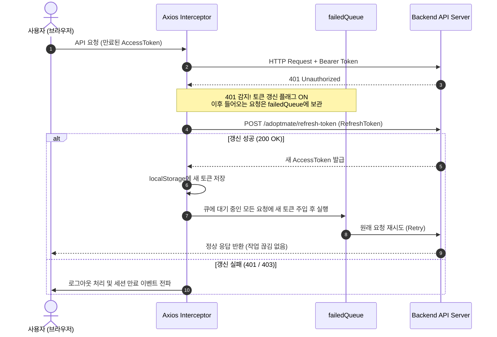

# 🐾 AdoptMate (PawMate) - Frontend

<div align="center">

> **"사지 말고 입양하세요"**  
> 유기동물과 새로운 가족을 따뜻하게 연결하는 풀스택 입양 & 커뮤니티 플랫폼의 **React 19 + TypeScript** 프론트엔드 웹 애플리케이션입니다.

[](https://react.dev/)
[](https://www.typescriptlang.org/)
[](https://vitejs.dev/)
[](https://reactrouter.com/)
[](https://axios-http.com/)
[](https://opensource.org/licenses/MIT)

</div>

<br/>

## 📖 목차
1. [프로젝트 소개](#-프로젝트-소개)
2. [기술 스택](#-기술-스택)
3. [주요 기능](#-주요-기능)
4. [프로젝트 구조](#-프로젝트-구조)
5. [핵심 아키텍처 & UX 포인트](#-핵심-아키텍처--ux-포인트)
6. [환경 변수 가이드](#-환경-변수-가이드)
7. [시작 가이드 (Getting Started)](#-시작-가이드-getting-started)
8. [페이지 & 라우팅 구조](#-페이지--라우팅-구조)
9. [컨벤션 & 기여 가이드](#-컨벤션--기여-가이드)
10. [로드맵 (Roadmap)](#-로드맵-roadmap)

---

## 🐶 프로젝트 소개

**AdoptMate**는 보호소의 유기동물 정보 확인부터 온라인 입양 신청, 입양 후기 및 무료 분양, 유기동물 긴급 제보까지 한곳에서 소통할 수 있도록 제작된 반응형 웹 플랫폼입니다.

- **안전하고 체계적인 입양 절차**: 조건별 실시간 다중 필터링, 관심 동물 찜하기, 온라인 입양 신청서 및 필수 서약 검증
- **활발한 소통 커뮤니티**: 입양 후기, 무료 분양, 긴급 유기동물 제보 및 계층형 대댓글 지원
- **사용자 중심의 UX**: 라이트/다크 모드, 스켈레톤 로더, 무한 스크롤, 마이크로 애니메이션, 웹 접근성 준수

---

## 🛠 기술 스택

### Core & Framework
- **Runtime & Library**: React 19 (`^19.1.0`)
- **Language**: TypeScript (`~5.8.0`)
- **Build Tool**: Vite 7 (`^7.0.0`)
- **Routing**: React Router DOM v7 (`^7.6.3`)
- **HTTP Client**: Axios (`^1.10.0`)
- **Storage / Upload**: Vercel Blob (`@vercel/blob ^2.8.0`)

### Styling & Design System
- **CSS Architecture**: CSS Modules (`*.module.css`) + Global CSS Variables
- **Design Tokens**: HSL 테마 컬러, Glassmorphism, 부드러운 트랜지션 및 마이크로 인터랙션
- **Theme**: 시스템 테마 감지 및 로컬스토리지 연동 **라이트 / 다크 모드 (FOUC 방지)**
- **Responsive Design**: 데스크톱, 태블릿, 모바일 완벽 대응 (모바일 가로 스크롤 및 터치 UX 최적화)

---

## 🚀 주요 기능

### 1. 🏠 메인 & 탐색 (Home & Discovery)
- **비주얼 히어로 슬라이더**: 자동 재생 및 마우스 호버 일시정지, 인터랙티브 닷/화살표 인디케이터
- **방금 들어온 새로운 가족**: 백엔드 API 연동 최신 등록 보호 동물 실시간 큐레이션 (공통 `AnimalCard` 적용)
- **입양 절차 안내 & Scroll Reveal**: 스크롤 위치에 맞춰 요소가 부드럽게 등장하는 인터랙티브 애니메이션
- **빠른 로그인 모달**: 비로그인 사용자를 위한 메인 화면 인라인 팝업 로그인

### 2. 🐾 유기동물 목록 & 상세 (Animals & Adoption)
- **다중 필터링 & 실시간 검색**: 종별(강아지/고양이/기타), 성별(수컷/암컷), 품종 및 색상 키워드 실시간 필터링
- **실시간 결과 카운트 안내**: 현재 필터에 부합하는 보호 동물 수(`🐾 현재 N마리`) 실시간 피드백
- **마이크로 바운스 찜하기(하트)**: 찜 토글 시 탄력 있는 하트 팝 애니메이션 및 비로그인 안내
- **숫자 페이지네이션 (`Pagination`)**: 직관적인 번호 선택(`1, 2, 3...`)과 이전/다음 네비게이션
- **상세 정보 & 맞춤 상태 배너**: 보호 상태(보호중, 대기중, 입양완료)에 따른 직관적 안내 배너
- **온라인 입양 신청서**: 주거 형태, 기존 반려동물 유무, 입양 동기 작성 및 평생 양육 필수 서약 검증

### 3. 💬 커뮤니티 (Community & Comments)
- **4가지 카테고리 탭**: `전체(📋)`, `입양 후기(💌)`, `무료 분양(🎁)`, `유기동물 제보(🚨)`
- **무한 스크롤(Infinite Scroll) & 종단 UI**: `Intersection Observer` 기반 자동 추가 로딩 및 마지막 페이지 도달 시 종단 UI(`모든 이야기를 다 불러왔습니다 🐾`)
- **드래그 앤 드롭 이미지 업로드**: 이미지 미리보기 및 Vercel Blob 안전 업로드
- **카테고리별 맞춤 안내**: 유기동물 제보 시 긴급 상담전화(1577-0954) 배너 및 무료 분양 가이드
- **계층형 대댓글 시스템**: 댓글 작성, 대댓글(답글) 작성/접기/펼치기, 본인 댓글 수정 및 삭제

### 4. 🔐 인증 & 회원 관리 (Authentication)
- **JWT 이중 토큰 인증**: Access Token 만료 시 Refresh Token을 통한 백그라운드 무중단 자동 갱신
- **이메일 인증 시스템**: 회원가입 시 인증 코드 발송 및 실시간 카운트다운 타이머(3분)
- **비밀번호 찾기 & 재설정**: 이메일 코드 검증 기반의 안전한 2단계 비밀번호 변경
- **카카오 OAuth2 소셜 로그인**: 카카오 인가 코드를 수신하여 자동 로그인 및 토큰 발급 처리
- **마이페이지**: 내 프로필 정보 조회, 관심 등록한 동물(찜 목록) 카드 그리드 바로가기, 회원 탈퇴

### 5. 👑 관리자 대시보드 (Admin Dashboard)
- **관리자 전용 라우트 보호 (`AdminRoute`)**: `ROLE_ADMIN` 권한 검증 및 비인가 접근 차단
- **동물 등록 및 상태 관리**: 새 보호동물 등록, 상태(대기/보호/입양완료) 수정 및 정보 삭제
- **사용자 관리**: 전체 가입 회원 목록 조회 및 권한 확인 (모바일 반응형 테이블 지원)
- **입양 신청 심사**: 접수된 모든 입양 신청서 확인 및 상태 승인/반려 관리

---

## 📁 프로젝트 구조

```text
paw-mate-frontend/
├── api/                        # Vercel Blob 이미지 업로드 서버리스 함수
│   └── upload.ts               # POST /api/upload
├── public/                     # 정적 에셋 (파비콘 등)
├── src/
│   ├── api/                    # 도메인별 API 모듈 및 Axios 인스턴스
│   │   ├── axiosInstance.ts    # JWT 토큰 인터셉터 및 401 무중단 갱신 큐
│   │   ├── auth.ts             # 로그인/회원가입/토큰재발급 API
│   │   ├── user.ts             # 내 정보/회원 관리/탈퇴 API
│   │   ├── animal.ts           # 보호 동물 목록/등록/수정/삭제 API
│   │   ├── adoption.ts         # 입양 신청서 제출/심사 관리 API
│   │   └── review.ts           # 후기·분양·제보 게시글 & 댓글 API
│   ├── assets/                 # 이미지 및 정적 미디어 리소스
│   ├── components/             # 공통 UI 컴포넌트
│   │   ├── Header.tsx          # 상단 네비게이션 & 모바일 드로어
│   │   ├── Footer.tsx          # 하단 푸터
│   │   ├── Layout.tsx          # 페이지 공통 레이아웃
│   │   ├── AnimalCard.tsx      # 동물 카드 (하트 바운스 마이크로 애니메이션)
│   │   ├── Pagination.tsx      # 번호 목록 선택 재사용 페이지네이션
│   │   ├── CommentSection.tsx  # 계층형 댓글/대댓글 컴포넌트
│   │   ├── ConfirmModal.tsx    # 커스텀 삭제/확인 모달
│   │   ├── FloatingInput.tsx   # 플로팅 라벨 인풋 필드
│   │   ├── ImageWithFallback.tsx # 비동기 디코딩(async) & 지연 로딩 이미지
│   │   ├── Toast.tsx / ToastContainer.tsx # 실시간 접근성(A11y) 토스트 알림
│   │   ├── Skeleton.tsx        # 스켈레톤 로더
│   │   └── ErrorBoundary.tsx   # React 에러 바운더리
│   ├── constants/              # 공통 상수 및 라벨 매핑 (animal, category 등)
│   ├── context/                # 글로벌 상태 관리 (React Context)
│   │   ├── AuthContext.tsx     # 사용자 인증 & 관리자 권한 상태
│   │   ├── ThemeContext.tsx    # 라이트/다크 테마 상태 (FOUC 방지)
│   │   ├── ToastContext.tsx    # 토스트 알림 디스패처
│   │   └── FavoritesContext.tsx # 계정별 독립 격리 찜(관심 동물) 상태
│   ├── hooks/                  # 커스텀 훅
│   │   ├── usePageTitle.ts     # 페이지별 브라우저 타이틀 관리
│   │   ├── useDebounce.ts      # 검색창 및 입력 지연(300ms) 디바운스
│   │   └── useScrollReveal.ts  # 메모이제이션 Intersection Observer 인터랙션
│   ├── pages/                  # 라우트 페이지 컴포넌트
│   │   ├── HomePage.tsx        # 메인 홈 (히어로 슬라이더, 최신 동물)
│   │   ├── AnimalList.tsx      # 동물 목록 (디바운스 검색, 카운트 뱃지, 페이지네이션)
│   │   ├── AnimalDetail.tsx    # 동물 상세
│   │   ├── AdoptionForm.tsx    # 입양 신청서 (실시간 전화번호 포맷터)
│   │   ├── AdoptionReviewListPage.tsx # 커뮤니티 목록 (무한 스크롤 & 종단 UI)
│   │   ├── AdoptionReviewDetail.tsx   # 커뮤니티 상세
│   │   ├── AdoptionReview.tsx         # 글쓰기 (Vercel Blob 이미지 업로드)
│   │   ├── AdoptionReviewEdit.tsx     # 글 수정
│   │   ├── Login.tsx / Register.tsx   # 로그인 / 이메일 인증 회원가입
│   │   ├── ForgotPassword.tsx         # 비밀번호 찾기 (2단계 인증)
│   │   ├── MyPage.tsx                 # 마이페이지 (프로필, 찜 목록, 신청 내역)
│   │   ├── AdoptionGuide.tsx / FAQ.tsx # 입양 안내 / 자주 묻는 질문
│   │   ├── admin/              # 관리자 전용 대시보드 및 심사 페이지
│   │   └── ...
│   ├── styles/                 # CSS Modules 및 글로벌 디자인 토큰
│   │   ├── global.css          # CSS 변수, 테마 토큰, 리셋
│   │   └── *.module.css        # 스코프 보장 컴포넌트별 모듈러 스타일
│   ├── types/                  # TypeScript 도메인 타입 정의 (Single Source of Truth)
│   ├── utils/                  # 유틸리티 함수
│   │   ├── validation.ts       # 전화번호 실시간 자동 하이픈 및 유효성 검사
│   │   ├── date.ts             # 날짜 및 시간 포맷터
│   │   └── imageUpload.ts      # Vercel Blob 이미지 업로드 헬퍼
│   ├── App.tsx                 # 코드 스플리팅 & 라우팅 정의
│   ├── main.tsx                # React 19 엔트리 포인트
│   └── vite-env.d.ts           # Vite 환경 타입 선언
├── index.html                  # HTML 템플릿 (웹폰트 Preconnect & 비차단 로드)
├── package.json
├── tsconfig.json               # TypeScript 설정
└── vite.config.ts              # Vite 설정 (Vendor Chunk 분리 & 빌드 최적화)
```

---

## ⚡ 핵심 아키텍처 & UX 포인트

### 1. 🛡️ 무중단 JWT 자동 갱신 큐 (`axiosInstance.ts`)



### 2. ⚡ 성능 최적화 (Performance Optimization)
- **Code Splitting**: `React.lazy()` 및 `Suspense`를 통해 모든 페이지 컴포넌트를 청크 단위로 분할 로딩.
- **Vendor Chunk Splitting**: `vite.config.ts`의 `manualChunks` 설정으로 거의 변하지 않는 핵심 라이브러리(`react`, `react-dom`, `react-router-dom`, `axios`)를 독립 번들로 분리하여 브라우저 장기 캐싱 효율 극대화.
- **웹폰트 비차단 로드 (Render-Blocking 해소)**: `index.html` 상단에 `<link rel="preconnect">`를 적용하고 CSS `@import`를 제거하여 FCP/LCP 단축.
- **이미지 비동기 디코딩**: `ImageWithFallback`에 `loading="lazy"` 및 `decoding="async"`를 적용하여 스크롤 중 UI 버벅임(Jank) 차단.
- **이벤트 리스너 패시브 최적화**: 전역 `scroll` 및 `resize` 이벤트에 `{ passive: true }`를 적용하여 60fps 부드러운 스크롤 보장.
- **입력 디바운스 (`useDebounce`)**: 검색창 타이핑 시 불필요한 과도한 리렌더링과 필터링 연산 방지.

### 3. 🎯 사용자 중심 기능 & 마이크로 인터랙션
- **마이크로 바운스 인터랙션**: 하트 찜 토글 시 CSS 키프레임 바운스 팝 애니메이션 적용.
- **계정별 찜(Favorites) 목록 격리**: 사용자 이메일별 로컬스토리지 키(`paw_mate_favs_${email}`)를 통해 계정 간 찜 목록 혼선 완벽 차단.
- **전화번호 실시간 자동 하이픈 (`validation.ts`)**: 입양 신청서 및 폼 입력 시 `010-XXXX-XXXX` 형식 자동 변환.
- **🌓 완전한 다크모드 지원**: `CSS Variables` 기반 테마 시스템으로 깜빡임(FOUC) 없이 부드러운 테마 전환 제공.
- **웹 접근성 (A11y)**: 토스트 알림에 상황별 `aria-live="assertive"` / `aria-live="polite"` 동적 적용.

---

## 🔑 환경 변수 가이드

프로젝트 루트 디렉토리에 `.env` 파일을 생성하고 아래 변수들을 설정합니다.

| 환경 변수 | 필수 여부 | 설명 | 예시값 |
| :--- | :---: | :--- | :--- |
| `VITE_API_BASE_URL` | **필수** | 백엔드 Spring Boot API 서버 주소 | `https://port-0-paw-mate-be-...sel4.cloudtype.app` |
| `BLOB_READ_WRITE_TOKEN` | 선택 | Vercel Blob 이미지 업로드 서버리스 토큰 | `vercel_blob_rw_...` |

---

## 💻 시작 가이드 (Getting Started)

### 1. 패키지 설치
```bash
npm install
```

### 2. 개발 서버 실행
```bash
npm run dev
```
브라우저에서 `http://localhost:5173`으로 접속합니다.

### 3. 프로덕션 빌드 및 타입 검사
```bash
npm run build
```

### 4. 린트 검사
```bash
npm run lint
```

---

## 🗺️ 페이지 & 라우팅 구조

| 경로 | 페이지 설명 | 접근 권한 |
| :--- | :--- | :--- |
| `/` | 메인 홈 (히어로 슬라이더, 신규 동물 큐레이션) | 전체 공개 |
| `/guide` | 입양 절차 및 안내 가이드 | 전체 공개 |
| `/animals` | 보호 동물 목록 (검색, 결과 카운트, 번호 페이지네이션) | 전체 공개 |
| `/animals/:id` | 동물 상세 정보 & 찜하기 | 전체 공개 (입양신청: 회원) |
| `/adopt/:animalId` | 입양 신청서 작성 | 회원 전용 (`USER`) |
| `/reviews` (`/community`) | 커뮤니티 (입양후기 / 무료분양 / 제보 목록 & 무한 스크롤) | 전체 공개 |
| `/reviews/:id` | 커뮤니티 상세 & 계층형 댓글 | 전체 공개 |
| `/review` | 커뮤니티 글쓰기 (Vercel Blob 사진 첨부) | 회원 전용 (`USER`) |
| `/reviews/:id/edit` | 커뮤니티 글 수정 | 작성자 / 관리자 |
| `/login` / `/register` | 로그인 / 이메일 인증 회원가입 | 비로그인 |
| `/forgot-password` | 2단계 비밀번호 재설정 | 비로그인 |
| `/mypage` | 마이페이지 (내 정보, 찜한 동물 목록 그리드, 탈퇴) | 회원 전용 (`USER`) |
| `/admin/users` | [관리자] 회원 관리 (반응형 테이블) | 관리자 (`ADMIN`) |
| `/admin/animals` | [관리자] 동물 등록 & 목록 관리 | 관리자 (`ADMIN`) |
| `/admin/adoptions` | [관리자] 입양 신청 심사 관리 | 관리자 (`ADMIN`) |
| `/faq` / `/terms` | 자주 묻는 질문 / 이용약관 | 전체 공개 |

---

## 🤝 컨벤션 & 기여 가이드

### Git 커밋 메시지 컨벤션
[Conventional Commits](https://www.conventionalcommits.org/) 규칙을 준수합니다.

- `feat`: 새로운 기능 추가
- `fix`: 버그 수정
- `refactor`: 코드 리팩터링 (동작 변경 없음)
- `style`: 코드 스타일/CSS 수정 (로직 변경 없음)
- `docs`: 문서 작성 및 수정 (`README.md` 등)
- `chore`: 빌드 설정, 패키지 매니저 설정 등

---

## 🗺️ 로드맵 (Roadmap)

- [x] **React 19 & Vite 7 마이그레이션**
- [x] **공통 `AnimalCard` 및 숫자 `Pagination` 모듈화**
- [x] **무한 스크롤 종단 UI 및 마이크로 바운스 인터랙션**
- [ ] **💬 실시간 1:1 입양 문의 채팅 (WebSocket 연동)**
- [ ] **🔔 브라우저 푸시 알림 (신청서 심사 승인/반려 알림)**
- [ ] **📱 PWA (Progressive Web App) 오프라인 모드 지원**

---

## 📄 라이선스

This project is licensed under the MIT License.
