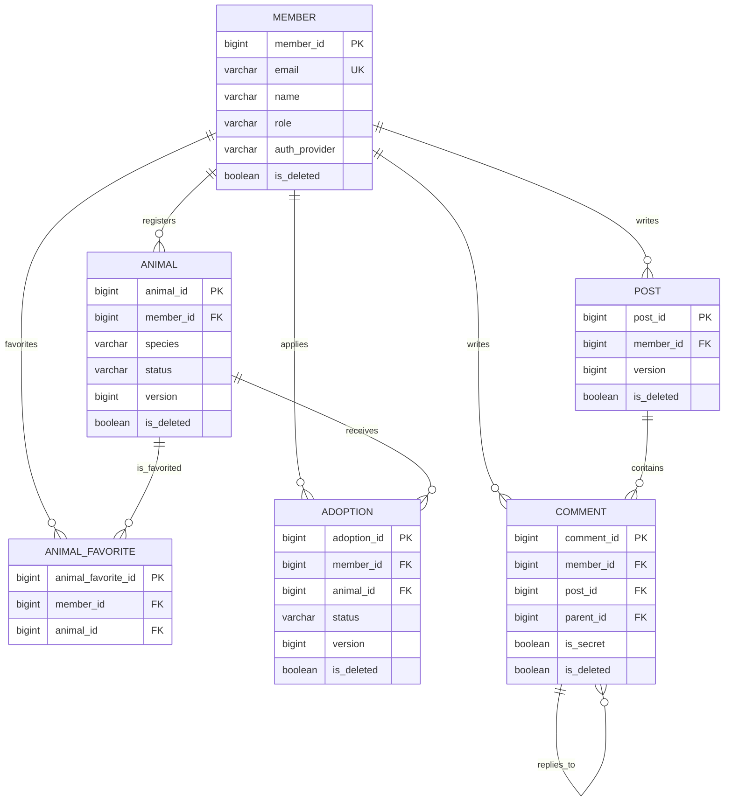

# 🐾 PawMate Backend

유기동물 입양 신청과 커뮤니티 기능을 제공하는 Spring Boot 백엔드입니다. 회원 인증, 이메일 인증, 카카오 OAuth2 로그인, JWT·Redis 토큰 관리, 입양 상태 관리와 분산 락 기반 동시성 제어를 포함합니다.

## 기술 스택

| 구분 | 사용 기술 |
| --- | --- |
| Language / Framework | Java 17, Spring Boot 3.5.3 |
| Persistence | Spring Data JPA, Hibernate, MySQL 8, H2(test) |
| Security | Spring Security, JWT (jjwt), OAuth2 Client |
| Cache / Lock | Redis, Redisson |
| API / Validation | SpringDoc OpenAPI, Jakarta Validation |
| Test | JUnit 5, AssertJ, Mockito |
| Build / Deploy | Gradle, Docker, Docker Compose |

## 주요 기능

- 회원가입, 로그인, JWT 재발급·로그아웃·회원 탈퇴
- 이메일 인증과 비밀번호 재설정
- 카카오 OAuth2 로그인
- 보호 동물 등록, 조회, 종별 조회, 상태 변경, 찜하기
- 입양 신청과 승인·반려 상태 전이
- 게시글·댓글 CRUD, 통합 검색, 좋아요·북마크 및 커서 기반 목록 조회
- Redis 캐시, Redisson 분산 락, JPA 낙관적 락

## 인증·보안 구조

- 일반 API는 JWT 기반으로 동작하며, OAuth2 인가 코드 흐름에 필요한 경우에만 세션을 생성합니다(`IF_REQUIRED`).
- `JwtAuthFilter`는 Bearer 토큰을 검증하고, Redis 블랙리스트와 사용자별 `tokenVersion`을 확인해 로그아웃·비밀번호 변경 전의 토큰을 차단합니다.
- JWT에 담긴 회원 ID·역할 claim으로 인증 객체를 구성해 인증 요청마다 회원 DB를 다시 조회하지 않습니다. 탈퇴·비밀번호 변경으로 인한 토큰 무효화는 Redis `tokenVersion`으로 반영합니다.
- Refresh Token은 Redis에 저장하며, Access Token 재발급·로그아웃·회원 탈퇴에 사용합니다. 재발급 시 Access Token과 Refresh Token을 모두 새로 발급하고 Redis 값을 교체하는 rotation 방식을 사용하므로, 기존 Refresh Token은 다시 사용할 수 없습니다. 비밀번호 변경 또는 재설정 시에는 Refresh Token을 삭제하고 `tokenVersion`을 증가시켜 이전 Access Token도 무효화합니다.
- Access Token과 Refresh Token에는 각각 고유한 JWT ID(`jti`)가 포함됩니다.
- 비밀번호는 BCrypt로 해시 처리합니다.
- 카카오 OAuth2 로그인과 일반 이메일 로그인을 모두 지원하며, 회원의 인증 제공자는 `AuthProvider`로 구분합니다.
- 관리자 전용 기능은 `@PreAuthorize("hasRole('ADMIN')")`로 보호합니다.

## 이메일 인증과 비밀번호 재설정

이메일 인증 관련 임시 상태는 Redis에만 저장하며, DB에 인증 코드를 저장하지 않습니다.

| 흐름 | 코드 유효 시간 | 실패 제한 | 추가 제한 |
| --- | ---: | ---: | --- |
| 회원가입 이메일 인증 | 3분 | 5회 | 실패 시 30분 차단, 성공 상태 10분 유지 |
| 비밀번호 재설정 | 5분 | 5회 | 재전송 1분 제한, 실패 시 30분 차단, 성공 상태 10분 유지 |

- 비밀번호 재설정 메일 요청은 존재하지 않는 이메일에도 정상 응답해 계정 존재 여부 노출을 줄입니다.
- 운영·기본 프로필에서는 인증 성공 후에만 회원가입 또는 비밀번호 재설정을 진행할 수 있습니다. 로컬·테스트 프로필은 개발 편의를 위해 가입 이메일 인증을 기본적으로 요구하지 않습니다.

## 캐시·정적 리소스·CORS

- Redis CacheManager의 기본 TTL은 5분이며, JSON 직렬화를 사용합니다.
- 캐시 대상은 보호 동물 목록·종별 목록, 게시글 목록, 사용자 인증 정보입니다.
- 동물·게시글 변경 시 관련 목록 캐시를 비우고, 비밀번호 변경·회원 삭제 시 사용자 인증 캐시를 비웁니다.
- `/uploads/**` 요청은 서버 실행 경로의 `uploads/` 디렉터리에 있는 파일을 정적 리소스로 제공합니다.
- CORS는 `localhost` 개발 환경과 `https://paw-mate-frontend.vercel.app`을 허용합니다. 인증 정보를 포함한 요청을 허용하므로, 새 프론트엔드 도메인은 `SecurityConfig`와 `CorsConfig` 양쪽에 추가해야 합니다.

## 조회·문서화 방식

### 페이지와 커서 페이징

목록 API는 화면 요구에 맞춰 `Page`와 `Slice`를 제공합니다.

| 방식 | 사용 경로 | 특징 |
| --- | --- | --- |
| Offset 페이지 | `/animals/list`, `/post/list` | 전체 건수와 페이지 메타데이터가 필요한 화면에 적합 |
| Cursor (`Slice`) | `/animals/cursor`, `/post/cursor` | `lastAnimalId`, `lastPostId` 기반. Count 쿼리 없이 무한 스크롤에 적합 |

게시글 커서는 정렬 기준과 ID를 함께 사용합니다. `latest`는 `createdAt DESC, id DESC`, `popular`는 `likeCount DESC, id DESC`, `comments`는 `commentCount DESC, id DESC`입니다. 요청 크기는 1~100개로 제한됩니다.

#### 게시글 커서 쿼리 구현

커서 기준 게시글의 값을 JPQL 서브쿼리에서 반복 조회하지 않습니다. 서비스 계층이 커서의 `createdAt`, 좋아요 수(`likeCount`), 댓글 수(`commentCount`)를 한 번 조회한 뒤 리포지토리 쿼리의 파라미터로 전달합니다.

- `latest`: 커서의 `createdAt`과 ID로 다음 페이지를 판별합니다.
- `popular`: 커서의 좋아요 수와 ID로 다음 페이지를 판별합니다.
- `comments`: 커서의 댓글 수와 ID로 다음 페이지를 판별합니다.

이 방식은 복잡하게 중첩된 JPQL 서브쿼리를 Hibernate가 초기화 시 파싱하면서 발생할 수 있는 `java.lang.OutOfMemoryError: Java heap space`를 방지하고, 정렬 동률에서는 ID를 보조 키로 사용해 페이지 간 중복·누락을 막습니다.

### 댓글 페이지네이션 정책

대댓글 관계를 보존하기 위해 **최상위 댓글만 페이지네이션**합니다. 각 최상위 댓글을 조회할 때는 해당 댓글의 대댓글을 함께 반환하므로, 하나의 댓글 스레드가 서로 다른 페이지로 나뉘지 않습니다.

```text
GET /comment/{postId}?page=0&size=20
```

- `page`는 0부터 시작하며, `size`의 기본값은 20입니다.
- 응답의 `result.content`에는 최상위 댓글과 각 댓글의 `children`이 포함됩니다.
- 대댓글이 매우 많은 경우에는 대댓글 전용 조회 API를 추가해 필요할 때 더 불러옵니다.

### Swagger 문서

각 컨트롤러의 OpenAPI 어노테이션은 `*ControllerDocs` 인터페이스에 분리되어 있습니다. 컨트롤러가 해당 인터페이스를 구현하므로, 엔드포인트 설명과 응답 스키마는 Swagger UI에서 확인할 수 있습니다.

## 프로젝트 구조

```text
src/main/java/com/kindtail/adoptmate
├── adoption    # 입양 신청, 상태 전이, 분산 락 Facade
├── animal      # 보호 동물, 찜하기
├── auth        # JWT, OAuth2, SecurityContext 유틸리티
├── comment     # 댓글과 대댓글
├── common      # 공통 응답·예외·메일·분산 락
├── config      # Security, Redis, Cache, Swagger 설정
├── member      # 회원 및 인증 관련 기능
└── post        # 커뮤니티 게시글
```

각 도메인은 `controller`, `domain`, `dto`, `repository`, `service`로 구성합니다. API 문서는 `*ControllerDocs` 인터페이스로 분리되어 있습니다.

### 패키지별 책임

| 패키지 | 책임 | 주요 구성 요소 |
| --- | --- | --- |
| `auth` | 인증, JWT, OAuth2, 세션 무효화 | `AuthenticationService`, `JwtAuthFilter`, `TokenSessionService`, `CurrentUserProvider` |
| `member` | 회원가입, 회원 정보·비밀번호·탈퇴 관리 | `MemberService`, `MemberFacade`, `MemberSessionInvalidationEvent` |
| `animal` | 보호 동물과 관심 동물 관리 | `AnimalService`, `AnimalFavoriteService` |
| `adoption` | 입양 신청과 상태 전이 | `AdoptionFacade`, `AdoptionService`, `DistributedLockTemplate` |
| `post` | 게시글 명령과 조회 | `PostService`(명령), `PostQueryService`(조회) |
| `comment` | 댓글·대댓글 관리 | `CommentService` |
| `common` | 공통 응답·예외, 메일, Redis 기반 인증 코드 | `CommonResponse`, `GlobalExceptionHandler`, `EmailVerificationService`, `PasswordResetService` |
| `config` | Security, CORS, Redis, JPA, Swagger 설정 | `SecurityConfig`, `CorsConfig`, `SecurityExceptionHandlers` |

### 계층 의존 규칙

```text
Controller → Facade/Service → Repository → Database/Redis
                 │
                 └─ Domain Entity (상태 변경과 권한 검증)
```

- Controller는 HTTP 요청·응답과 Bean Validation만 처리합니다.
- Service는 유스케이스와 트랜잭션 경계를 담당하며, 조회와 변경이 복잡한 게시글은 `PostQueryService`와 `PostService`로 나뉩니다.
- Facade는 입양 신청처럼 여러 서비스·락을 조합해야 하는 흐름에만 사용합니다.
- Repository는 데이터 조회/저장만 담당하며, 인증된 사용자 정보는 `CurrentUserProvider`를 통해 가져옵니다.

## API 빠른 명세

모든 성공 응답은 `CommonResponse` 형식입니다. 인증이 필요한 요청은 `Authorization: Bearer {accessToken}` 헤더를 포함해야 합니다. `공개`는 비로그인 요청이 가능한 API이고, `인증`은 로그인 사용자, `관리자`는 `ADMIN` 역할을 뜻합니다.

### 인증·회원·이메일

| Method | Path | 권한 | 요청 요약 | 결과 |
| --- | --- | --- | --- | --- |
| POST | `/adoptmate/register` | 공개 | `name`, `email`, `password` | 회원 정보 |
| POST | `/adoptmate/login` | 공개 | `email`, `password` | Access/Refresh Token, 이메일, 역할 |
| POST | `/adoptmate/refresh-token` | 공개 | `refreshToken` | 새 Access/Refresh Token |
| POST | `/adoptmate/logout` | 인증 | Bearer Token | `null` |
| GET | `/adoptmate/myInfo` | 인증 | - | 내 회원 정보 |
| POST | `/adoptmate/password` | 인증 | `currentPassword`, `newPassword` | `null` |
| DELETE | `/adoptmate/delete` | 인증 | - | `null` |
| GET | `/adoptmate` | 관리자 | `page`, `size`, `sort` | 회원 `Page` |
| GET | `/adoptmate/all` | 관리자 | - | 회원 목록 |
| DELETE | `/adoptmate/admin/{memberId}` | 관리자 | - | `null` |
| POST | `/adoptmate/verify-email` | 공개 | `email` | `null` |
| POST | `/adoptmate/verify-code` | 공개 | `email`, `code` | 검증한 이메일·코드 |
| POST | `/adoptmate/send-reset-code` | 공개 | query: `email` | `null` |
| POST | `/adoptmate/verify-reset-code` | 공개 | query: `email`, `code` | `null` |
| PATCH | `/adoptmate/password` | 공개 | `email`, `password` | `null` |

`POST /adoptmate/password`는 로그인한 사용자의 비밀번호 변경이고, `PATCH /adoptmate/password`는 이메일 재설정 인증을 마친 뒤 수행하는 비밀번호 재설정입니다.

### 보호 동물·입양

| Method | Path | 권한 | 요청/쿼리 요약 | 결과 |
| --- | --- | --- | --- | --- |
| POST | `/api/v1/animals` | 관리자 | 동물 등록 정보 | 동물 1건 |
| GET | `/api/v1/animals` | 공개 | `page`(0 이상), `size`(1~100) | 동물 `Page` |
| GET | `/api/v1/animals/cursor` | 공개 | `lastAnimalId`, `size`(1~100) | 동물 `Slice` |
| GET | `/api/v1/animals/species` | 공개 | `species`, `page`, `size` | 동물 `Page` |
| GET | `/api/v1/animals/{id}` | 공개 | - | 동물 1건 |
| PUT | `/api/v1/animals/{id}/status` | 관리자 | 상태 변경 정보 | 동물 1건 |
| DELETE | `/api/v1/animals/{id}` | 관리자 | - | `null` |
| POST | `/api/v1/animals/{id}/favorite` | 인증 | - | 관심 상태 |
| DELETE | `/api/v1/animals/{id}/favorite` | 인증 | - | 관심 상태 |
| GET | `/api/v1/animals/favorites/my` | 인증 | `page`, `size` | 관심 동물 `Page` |
| POST | `/adoptions/animals/{animalId}` | 인증 | 입양 신청 정보 | 입양 신청 1건 |
| GET | `/adoptions/myAdoption` | 인증 | - | 내 입양 신청 목록 |
| GET | `/adoptions/list` | 관리자 | `page`, `size`, `sort` | 입양 신청 `Page` |
| PUT | `/adoptions/{adoptionId}/status` | 관리자 | `adoptionStatus` | 변경된 입양 신청 |

### 커뮤니티

| Method | Path | 권한 | 요청/쿼리 요약 | 결과 |
| --- | --- | --- | --- | --- |
| POST | `/api/v1/posts` | 인증 | `title`, `content`, `img`, `category` | 게시글 1건 |
| GET | `/api/v1/posts` | 공개 | `page`, `size`, `sort` | 게시글 `Page` |
| GET | `/api/v1/posts/cursor` | 공개 | `lastPostId`, `size`(1~100), `category`, `keyword`, `sort` | 게시글 `Slice` |
| GET | `/api/v1/posts/{postId}` | 공개 | - | 게시글 1건 |
| PUT | `/api/v1/posts/{postId}` | 인증 | `title`, `content`, `img` | 변경된 게시글 |
| DELETE | `/api/v1/posts/{postId}` | 인증 | - | `null` |
| POST/DELETE | `/api/v1/posts/{postId}/likes` | 인증 | - | 좋아요 상태·개수 |
| POST/DELETE | `/api/v1/posts/{postId}/bookmarks` | 인증 | - | 북마크 상태 |
| GET | `/api/v1/posts/bookmarks/me` | 인증 | `size`(1~100) | 북마크 게시글 `Slice` |
| POST | `/comment/{postId}` | 인증 | `content`, 선택 `parentId`, 선택 `secret` | 댓글 1건 |
| GET | `/comment/{postId}` | 공개 | `page`, `size`, `sort` | 최상위 댓글 `Page` |
| PUT | `/comment/{commentId}` | 인증 | `content` | 변경된 댓글 |
| DELETE | `/comment/{commentId}` | 인증 | - | `null` |

호환 경로(`/animals`, `/post`, `/animals/register`, `/post/create` 등)는 기존 클라이언트 지원을 위해 함께 제공됩니다. 신규 클라이언트는 표의 `/api/v1/**` 경로를 사용하세요.

### 비밀 댓글

댓글 생성 요청에 `secret: true`를 포함하면 비밀 댓글이 됩니다. 생략하거나 `false`이면 공개 댓글입니다.

```json
{
  "parentId": null,
  "content": "입양 관련 문의입니다.",
  "secret": true
}
```

- 비밀 댓글 내용은 댓글 작성자, 해당 게시글 작성자, `ADMIN` 역할만 확인할 수 있습니다.
- 그 외 로그인 사용자와 비로그인 사용자는 댓글의 `secret` 값은 확인할 수 있지만, `content`에는 `비밀 댓글입니다.`가 반환됩니다.
- 대댓글도 동일한 API에서 `parentId`와 `secret: true`를 함께 보내면 비밀 대댓글로 생성됩니다. 조회 권한과 내용 마스킹 규칙도 일반 비밀 댓글과 동일합니다.
- 운영/기존 데이터베이스에는 아래 마이그레이션을 먼저 적용해야 합니다. `JPA_DDL_AUTO=validate` 환경에서는 이 컬럼이 없으면 애플리케이션이 시작되지 않습니다.

```sql
ALTER TABLE comment ADD COLUMN is_secret BOOLEAN NOT NULL DEFAULT FALSE;
```

## 최근 구조 개선

- `AuthenticationService`가 로그인, Refresh Token 회전, 로그아웃을 전담합니다. 토큰의 Redis 저장·블랙리스트·`tokenVersion` 검증은 `TokenSessionService`에 모아 두었습니다.
- `JwtAuthFilter`는 서명 검증된 JWT의 회원 ID·역할 claim으로 인증 객체를 만들기 때문에, 매 인증 요청마다 회원 DB를 조회하지 않습니다. 회원 탈퇴와 비밀번호 변경 시에는 `tokenVersion`을 증가시켜 기존 Access Token과 Refresh Token을 무효화합니다.
- 이메일 기능은 역할에 따라 분리했습니다. `EmailVerificationService`는 회원가입 인증 코드 발송·검증을, `PasswordResetService`는 비밀번호 재설정 코드 발송·검증과 비밀번호 변경을 담당합니다.
- 게시글은 명령과 조회를 분리했습니다. `PostService`는 작성·수정·삭제·좋아요·북마크 변경을, `PostQueryService`는 목록·검색·상세·내 북마크 조회를 담당합니다. 목록 조회 시 좋아요 수·댓글 수·사용자별 상태를 배치 조회해 N+1 조회를 피합니다.
- 현재 사용처가 없는 `MemberEmailResponse`, `PasswordResetSendRequest`, `PasswordResetVerifyRequest`와 이전 이메일 전송 메서드는 제거했습니다.

### 테스트 검증

```bash
./gradlew test
```

전체 테스트는 H2와 Mockito를 사용하며, 최근 리팩터링 후 테스트 결과는 실패 0건입니다.

## 실행하기

### 사전 요구 사항

- JDK 17
- MySQL 8 및 Redis 7, 또는 Docker Compose
- 카카오 로그인·메일 기능 사용 시 해당 자격 증명

### 환경 변수

`.env.example`을 복사해 `.env`를 만들고 값을 설정합니다.

```bash
cp .env.example .env
```

Windows PowerShell에서는 다음 명령을 사용합니다.

```powershell
Copy-Item .env.example .env
```

필수 설정 항목입니다.

| 그룹 | 변수 |
| --- | --- |
| Profile / Server | `SPRING_PROFILES_ACTIVE`, `SERVER_PORT` |
| MySQL | `DB_HOST`, `DB_PORT`, `DB_NAME`, `DB_USERNAME`, `DB_PASSWORD` |
| Redis | `REDIS_HOST`, `REDIS_PORT`, `REDIS_PASSWORD` |
| JWT | `JWT_SECRET_KEY`, `JWT_SECRET_KEY_RT`, `JWT_EXPIRATION`, `JWT_EXPIRATION_RT` |
| Kakao | `KAKAO_CLIENT_ID`, `KAKAO_CLIENT_SECRET`, `KAKAO_REDIRECT_URI` |
| Mail | `MAIL_HOST`, `MAIL_PORT`, `MAIL_USERNAME`, `MAIL_PASSWORD` |
| Client | `CLIENT_URL` |
| JPA schema | `JPA_DDL_AUTO` (`update` for local development, `validate` by default/production) |
| Email verification | `EMAIL_VERIFICATION_REQUIRED` (기본/운영 `true`, local/test `false`) |

기본값과 운영 프로필은 `JPA_DDL_AUTO=validate`입니다. 기존 스키마와 데이터를 삭제할 수 있는 `create`는 운영에서 사용하지 마세요. 필요한 스키마 변경은 SQL 마이그레이션으로 적용해야 하며, 새 운영 DB도 애플리케이션 실행 전에 스키마를 준비해야 합니다.

`animal.image`와 `post.image`는 이미지 URL 또는 Base64/data URL이 2,048자를 넘을 수 있으므로 MySQL `LONGTEXT`로 저장합니다. 기존 데이터베이스에서 다음 변경을 한 번 적용한 뒤 애플리케이션을 재배포하세요.

```sql
ALTER TABLE animal MODIFY COLUMN image LONGTEXT;
ALTER TABLE post MODIFY COLUMN image LONGTEXT;
```

이 변경을 적용하지 않은 상태에서 Hibernate가 `VARCHAR(2048)`로 컬럼을 축소하려 하면 기존 긴 데이터 때문에 `Data truncation` 오류가 발생합니다.

컨트롤러가 Swagger 문서 인터페이스를 구현하는 경우 Bean Validation 제약(`@NotBlank`, `@Email`, `@Valid` 등)은 인터페이스와 구현체 중 한 곳에만 선언하고 동일하게 유지해야 합니다. 구현체 메서드에만 제약을 추가하면 `OverridingMethodMustNotAlterParameterConstraints` 오류가 발생합니다.

> `.env`에는 비밀값이 포함되므로 Git에 커밋하지 않습니다.

### 로컬 실행

```bash
./gradlew bootRun
```

Windows에서는 `gradlew.bat bootRun`을 사용합니다. 기본 포트는 `8000`입니다.

### Docker Compose 실행

```bash
docker compose up -d --build
```

Compose는 MySQL, Redis, backend 컨테이너를 함께 실행합니다.

### API 문서

서버 실행 후 Swagger UI에서 API를 확인할 수 있습니다.

```text
http://localhost:8000/swagger-ui/index.html
```

OpenAPI JSON 문서는 아래 주소에서 제공합니다. 프론트엔드 타입 생성의 기준으로 사용하세요.

```text
http://localhost:8000/v3/api-docs
```

## 프론트엔드 연동 가이드

### 환경 변수와 API 클라이언트

Vite 기준으로 프론트엔드 `.env`에 백엔드 주소를 설정합니다.

```dotenv
VITE_API_BASE_URL=http://localhost:8000
```

`fetch` 또는 Axios 인스턴스의 base URL로 사용합니다. 인증이 필요한 요청에는 Access Token을 Bearer 헤더로 전달합니다.

```ts
const api = axios.create({
  baseURL: import.meta.env.VITE_API_BASE_URL,
});

api.interceptors.request.use((config) => {
  const token = authStore.getState().accessToken;
  if (token) {
    config.headers.Authorization = `Bearer ${token}`;
  }
  return config;
});
```

서버는 토큰을 쿠키가 아닌 JSON 본문으로 반환합니다. Access Token은 메모리 상태에 보관하고, Refresh Token의 브라우저 저장 방식은 서비스 보안 정책에 맞춰 결정하세요.

### 로그인과 토큰 재발급

```http
POST /adoptmate/login
Content-Type: application/json

{
  "email": "user@example.com",
  "password": "password"
}
```

성공 시 `result.token`, `result.refreshToken`, `result.email`, `result.role`을 받습니다. Access Token 만료로 `401`이 발생하면 아래 API로 Access Token과 Refresh Token을 모두 새로 발급받고, 실패하면 로그인 화면으로 이동합니다.

```http
POST /adoptmate/refresh-token
Content-Type: application/json

{
  "refreshToken": "..."
}
```

재발급 성공 응답은 `result.token`(새 Access Token)과 `result.refreshToken`(새 Refresh Token)을 반환합니다. 새 Refresh Token을 저장하고 기존 Refresh Token은 폐기해야 합니다. 로그아웃은 `POST /adoptmate/logout`에 현재 Access Token을 담아 요청합니다.

### 공통 응답 처리

모든 성공 응답은 `CommonResponse`의 `result`에 실제 데이터를 담습니다. 프론트 API 래퍼에서 공통으로 언래핑하면 화면 코드가 단순해집니다.

```ts
type ApiResponse<T> = {
  statusCode: number;
  code: string;
  statusMessage: string;
  result: T;
};

const { data } = await api.get<ApiResponse<AnimalResponse>>('/api/v1/animals/1');
const animal = data.result;
```

오류는 `statusCode`, `code`, `statusMessage`을 반환합니다. 권장 처리 기준은 다음과 같습니다.

| 상태 | 대표 코드 | 프론트 처리 |
| --- | --- | --- |
| `400` | `C001`, `M003`, `E001` | 입력 항목 또는 안내 메시지 표시 |
| `401` | `M004`, `M005`, `E004` | 토큰 재발급 시도 후 실패하면 로그인 이동 |
| `403` | `C004` | 권한 없음 화면 또는 알림 표시 |
| `404` | `A001`, `P001`, `CM001` | 존재하지 않는 리소스 안내 |
| `409` | `L001`, `L002` | 최신 데이터 새로고침 후 재시도 안내 |
| `429` | `E003` | 재시도 가능 시간 안내 |

### 목록과 무한 스크롤

Offset 방식은 `page`, `size`를 사용하고 `result.content`에서 목록을 읽습니다.

```text
GET /api/v1/animals?page=0&size=10
GET /api/v1/posts?page=0&size=10
```

무한 스크롤은 커서 엔드포인트를 사용합니다. 첫 요청에는 `lastAnimalId` 또는 `lastPostId`를 생략하고, 다음 요청에는 이전 응답 `result.content`의 마지막 항목 ID를 전달합니다. `result.hasNext`가 `false`이면 더 이상 요청하지 않습니다.

```text
GET /animals/cursor?size=10
GET /animals/cursor?lastAnimalId=42&size=10
GET /post/cursor?size=10
GET /post/cursor?lastPostId=42&size=10
```

### 카카오 OAuth2 팝업 연동

1. 팝업에서 `${VITE_API_BASE_URL}/oauth2/authorization/kakao`로 이동합니다.
2. 로그인 성공 시 백엔드는 opener 창으로 `postMessage`를 보내고 팝업을 닫습니다.
3. 프론트는 반드시 백엔드 주소를 `event.origin`과 비교한 뒤 메시지를 처리합니다.

```ts
window.addEventListener('message', (event) => {
  if (event.origin !== import.meta.env.VITE_API_BASE_URL) return;
  if (event.data?.type !== 'OAUTH_SUCCESS') return;

  const { token, refreshToken, id, role, provider } = event.data;
  // 인증 상태 저장 후 원하는 페이지로 이동
});
```

메시지 데이터는 `type`, `token`, `refreshToken`, `id`, `role`, `provider` 필드를 포함합니다. 백엔드의 `CLIENT_URL`은 프론트 앱의 origin과 정확히 일치해야 합니다.

### OpenAPI 타입 생성

프론트 프로젝트에서 OpenAPI 스키마로 타입을 생성하면 DTO 변경 누락을 줄일 수 있습니다.

```bash
npx openapi-typescript http://localhost:8000/v3/api-docs -o src/api/schema.d.ts
```

생성 파일은 직접 수정하지 않고, 백엔드 DTO나 API가 변경된 뒤 다시 생성합니다.

## 테스트

```bash
# 기본 테스트: benchmark와 외부 Redis가 필요한 integration 테스트 제외
./gradlew test

# Redis가 실행 중인 환경에서 분산 락 통합 테스트 실행
./gradlew integrationTest

# 벤치마크 테스트 실행
./gradlew benchmarkTest
```

기본 테스트는 H2와 mock을 사용하며 외부 Redis에 연결하지 않습니다. `integrationTest`는 실제 Redis가 필요합니다.

## API 응답 형식

성공 응답은 HTTP 상태와 업무 코드를 함께 반환합니다.

```json
{
  "statusCode": 200,
  "code": "A102",
  "statusMessage": "동물 목록 조회 성공",
  "result": {}
}
```

오류 응답도 동일한 상위 구조를 사용하며, `code`에는 `ErrorCode` 값이 들어갑니다.

```json
{
  "statusCode": 400,
  "code": "C001",
  "statusMessage": "유효하지 않은 입력값입니다."
}
```

## 데이터베이스

운영·개발 환경은 MySQL 8을 사용하고, 테스트 프로필은 H2의 MySQL 호환 모드를 사용합니다. 연결 정보는 `DB_*` 환경 변수로 설정합니다.

### ERD



### 엔티티별 역할

| 테이블 | 설명 | 주요 제약·관계 |
| --- | --- | --- |
| `member` | 회원, 역할, 소셜 로그인 정보 | `email` 유니크, `auth_provider` 필수 |
| `animal` | 보호 동물 정보와 입양 상태 | 등록 회원(`member_id`) 참조, `version` 낙관적 락 |
| `adoption` | 회원의 입양 신청서 | 회원·동물 참조, `(member_id, animal_id)` 유니크, `version` 낙관적 락 |
| `animal_favorite` | 회원의 관심 동물 | `(member_id, animal_id)` 유니크로 중복 찜 방지 |
| `post` | 커뮤니티 게시글 | 작성 회원 참조, `version` 낙관적 락 |
| `post_like` | 게시글 좋아요 | `(post_id, member_id)` 유니크로 중복 좋아요 방지 |
| `post_bookmark` | 게시글 북마크 | `(post_id, member_id)` 유니크로 중복 북마크 방지 |
| `comment` | 댓글 및 대댓글 | 게시글·작성 회원 참조, `parent_id` 자기 참조, `is_secret` 비밀 댓글 여부 |

### 공통 컬럼과 삭제 정책

모든 주요 엔티티는 `BaseTimeEntity`를 상속해 다음 컬럼을 공유합니다.

- `created_at`: 생성 시각
- `updated_at`: 최종 수정 시각
- `is_deleted`: 논리 삭제 여부

`member`, `animal`, `adoption`, `post`, `comment`는 Hibernate의 `@SQLDelete`, `@SQLRestriction`을 사용합니다. 삭제 시 데이터는 보존하고 일반 조회에서는 제외합니다. 회원 삭제 시에는 이메일을 `deleted_{id}_...` 형식으로 변경해 기존 이메일의 재가입을 허용합니다.

### 조회 성능과 무결성

- `animal`: 삭제 여부·종·상태와 ID를 조합한 인덱스로 목록/커서 조회를 지원합니다.
- `post`: 삭제 여부와 ID·생성 시각 인덱스로 최신순 목록 조회를 지원합니다.
- `@Version`: `animal`, `adoption`, `post`의 동시 수정 충돌을 감지해 `409 Conflict`로 처리합니다.
- `default_batch_fetch_size: 100`: 연관 엔티티 조회 시 N+1 문제를 줄입니다.

## 동시성 및 데이터 무결성

- 입양 신청과 회원가입은 `DistributedLockTemplate`을 통해 Redisson 분산 락을 사용합니다.
- 보호 동물, 입양 신청, 게시글 등은 JPA `@Version` 기반 낙관적 락으로 동시 수정 충돌을 감지합니다.
- 입양은 `PENDING` 상태에서만 `APPROVED` 또는 `REJECTED`로 변경할 수 있습니다.
- 승인 시 대상 동물은 `ADOPTED`로 변경되고, 같은 동물의 다른 신청은 반려 처리됩니다.
- 엔티티는 Soft Delete(`@SQLDelete`, `@SQLRestriction`)를 사용합니다.

## 코드 컨벤션

- [CONTRIBUTING.md](CONTRIBUTING.md)의 DTO 명명, API 설계, 테스트 규칙을 따릅니다.
- [.editorconfig](.editorconfig)는 UTF-8, 공백 4칸(Java), 줄 끝 공백 제거 규칙을 제공합니다.
- Request DTO는 `*Request`, Response DTO는 `*Response` 형식을 사용합니다.
- 컨트롤러가 Swagger 문서 인터페이스를 구현하면, 파라미터 검증 제약도 인터페이스에 선언합니다.

## 프로필

| 프로필 | 용도 |
| --- | --- |
| `local` | 로컬 개발 환경 |
| `prod` | 운영 환경. JPA schema 검증과 운영 로그 레벨 적용 |
| `test` | H2 기반 테스트 환경 |

`local`은 `ddl-auto=update`와 SQL DEBUG 로그를 사용합니다. `prod`는 기본적으로 `ddl-auto=validate`, SQL 로그 비활성화, 운영용 HikariCP 연결 검증·유지 설정을 사용합니다.

## 라이선스

이 저장소의 라이선스 정책은 별도로 정의되어 있지 않습니다.

## API 상세 명세

기준 URL은 `http://localhost:8000`이며, 요청과 응답 본문은 `application/json`입니다. 아래 표에는 **권장 경로만 한 번씩** 기재합니다. 인증 API에는 `Authorization: Bearer <accessToken>` 헤더를 사용합니다. 모든 응답 데이터는 공통 응답 객체의 `result`에 담깁니다.

### 문서 바로가기

| 먼저 확인할 내용 | 이동 |
| --- | --- |
| 공통 응답·인증 규칙 | [공통 규칙](#공통-규칙) |
| 회원가입·로그인 | [회원·인증·이메일](#회원--인증--이메일) |
| 동물·찜하기 | [보호 동물](#보호-동물) |
| 입양 신청·심사 | [입양 신청](#입양-신청) |
| 게시글·댓글 | [게시글·댓글](#게시글--댓글) |
| 바로 호출해 보기 | [요청·응답 상세 예시](#요청응답-상세-예시) |

> **빠른 시작**
>
> 1. `POST /adoptmate/login`으로 토큰을 발급합니다.
> 2. 보호 동물·게시글 목록은 토큰 없이 조회할 수 있습니다.
> 3. 생성·수정·삭제 요청에는 `Authorization: Bearer <accessToken>`을 추가합니다.

### 공통 규칙

| 항목 | 규칙 |
| --- | --- |
| 권한 표기 | `공개`: 토큰 불필요 · `인증`: 로그인 필요 · `ADMIN`: 관리자 역할 필요 |
| 페이지 조회 | `page`는 0부터 시작하며 기본값은 0, `size` 기본값은 10, 최대값은 100입니다. 동물·게시글 커서와 북마크 조회도 `size`는 1~100으로 제한됩니다. `result`는 `Page` 형식입니다. |
| 커서 조회 | 최초 요청은 커서를 생략하고, 다음 요청에는 직전 `content` 마지막 항목의 ID를 전달합니다. `hasNext=false`이면 종료합니다. |
| 시간 | `LocalDateTime`은 ISO-8601 문자열로 반환됩니다. |

### 회원 · 인증 · 이메일

| 메서드 | 경로 | 권한 | 요청 | `result` |
| --- | --- | --- | --- | --- |
| POST | `/adoptmate/register` | 공개 | `name`, `email`, `password`(6자 이상), `role`(`USER`/`ADMIN`) | `id`, `name`, `email`, `password`, `role`, `profileImage`, `authProvider`, `socialId` |
| POST | `/adoptmate/login` | 공개 | `email`, `password` | `token`, `refreshToken`, `email`, `role` |
| POST | `/adoptmate/refresh-token` | 공개 | `refreshToken` | `token`, `refreshToken` |
| POST | `/adoptmate/logout` | 인증 | 없음 | `null` |
| GET | `/adoptmate/myInfo` | 인증 | 없음 | `id`, `name`, `email`, `role` |
| GET | `/adoptmate/all` | ADMIN | 없음 | 회원 정보 배열 |
| POST | `/adoptmate/password` | 인증 | `currentPassword`, `newPassword`(6자 이상) | `null` |
| DELETE | `/adoptmate/delete` | 인증 | 없음 | `null` |
| DELETE | `/adoptmate/admin/{memberId}` | ADMIN | 경로: `memberId` | `null` |
| POST | `/adoptmate/verify-email` | 공개 | `email` | `null` |
| POST | `/adoptmate/verify-code` | 공개 | `email`, `code` | `email`, `code` |
| POST | `/adoptmate/send-reset-code?email={email}` | 공개 | 쿼리: `email` | `null` |
| POST | `/adoptmate/verify-reset-code?email={email}&code={code}` | 공개 | 쿼리: `email`, `code` | `null` |
| PATCH | `/adoptmate/password` | 공개 | `email`, `password`(6자 이상) | `null` |
| GET | `/oauth2/authorization/kakao` | 공개 | 없음 | Kakao 로그인 화면으로 리다이렉트 |
| GET | `/adoptmate/kakao?code={code}` | 공개 | 쿼리: Kakao 인가 코드 | 팝업 완료 HTML 및 `OAUTH_SUCCESS` postMessage |

`POST /adoptmate/password`는 로그인한 사용자의 비밀번호 변경이고, `PATCH /adoptmate/password`는 이메일 인증 후 비밀번호 재설정입니다.

### 보호 동물

`species`: `DOG`, `CAT`, `ETC` · `gender`: `MALE`, `FEMALE` · `status`: `WAITING`, `PROTECTED`, `ADOPTED`입니다. 동물 응답은 `id`, `species`, `breed`, `color`, `status`, `age`, `gender`, `image`를 반환합니다.

| 메서드 | 경로 | 권한 | 요청 | `result` |
| --- | --- | --- | --- | --- |
| POST | `/api/v1/animals` | 인증 | `species`, `breed`, `color`, `image`(선택), `age`(0 이상), `gender`, `status` | 동물 1건 |
| GET | `/api/v1/animals` | 공개 | 쿼리: `page`, `size` | 동물 `Page` |
| GET | `/api/v1/animals/cursor` | 공개 | 쿼리: `lastAnimalId`(선택), `size` | 동물 `Slice` |
| GET | `/api/v1/animals/species` | 공개 | 쿼리: `species`(필수), `page`, `size` | 동물 `Page` |
| GET | `/api/v1/animals/{id}` | 공개 | 경로: `id` | 동물 1건 |
| PUT | `/api/v1/animals/{id}/status` | ADMIN | `status` | 변경된 동물 1건 |
| DELETE | `/api/v1/animals/{id}` | ADMIN | 경로: `id` | `null` |
| POST | `/api/v1/animals/{id}/favorite` | 인증 | 경로: `id` | `animalId`, `isFavorite`, `favoriteCount` |
| DELETE | `/api/v1/animals/{id}/favorite` | 인증 | 경로: `id` | `animalId`, `isFavorite`, `favoriteCount` |
| GET | `/api/v1/animals/favorites/my` | 인증 | 쿼리: `page`, `size` | 동물 `Page` |

### 입양 신청

`housingType`: `APARTMENT`, `DETACHED_HOUSE`, `VILLA`, `ONE_ROOM`, `ETC` · 상태: `PENDING`, `APPROVED`, `REJECTED`입니다. 응답은 `adoptionId`, `animalId`, `animalBreed`, `animalImage`, `userName`, `phone`, `housingType`, `hasPet`, `reason`, `status`, `applyDate`를 반환합니다.

| 메서드 | 경로 | 권한 | 요청 | `result` |
| --- | --- | --- | --- | --- |
| POST | `/adoptions/animals/{animalId}` | 인증 | `phone`(휴대폰 형식), `housingType`, `hasPet`, `reason`(10자 이상) | 입양 신청 1건 |
| GET | `/adoptions/myAdoption` | 인증 | 없음 | 입양 신청 배열 |
| GET | `/adoptions/all` | ADMIN | 없음 | 입양 신청 배열 |
| GET | `/adoptions/list` | ADMIN | 쿼리: `page`, `size`, `sort` | 입양 신청 `Page` |
| PUT | `/adoptions/{adoptionId}/status` | ADMIN | `adoptionStatus` | 변경된 입양 신청 1건 |

### 게시글 · 댓글

게시글 작성·수정은 `title`, `content`가 필수이고 `img`, `category`는 선택입니다. `category`는 `REVIEW`, `FREE_ADOPTION`, `REPORT` 중 하나이며 생략 시 `REVIEW`입니다. 게시글 응답에는 `id`, `title`, `content`, `email`, `name`, `createdAt`, `img`, `likeCount`, `commentCount`, `likedByMe`, `bookmarkedByMe`가 포함됩니다. 비로그인 조회의 `likedByMe`, `bookmarkedByMe`는 항상 `false`입니다. 댓글 작성은 `content`와 `parentId`(대댓글일 때만)를 사용하며, 댓글 응답의 `children`에는 하위 댓글 배열이 포함됩니다.

| 메서드 | 경로 | 권한 | 요청 | `result` |
| --- | --- | --- | --- | --- |
| POST | `/api/v1/posts` | 인증 | `title`, `content`, `img`(선택), `category`(선택) | 게시글 1건 |
| GET | `/api/v1/posts` | 공개 | 쿼리: `page`, `size`, `sort` | 게시글 `Page` |
| GET | `/api/v1/posts/cursor` | 공개 | 쿼리: `lastPostId`(선택), `size`, `category`(선택), `keyword`(선택), `sort`(선택: `latest`/`popular`/`comments`) | 게시글 `Slice` |
| GET | `/api/v1/posts/{postId}` | 공개 | 경로: `postId` | 게시글 1건 |
| PUT | `/api/v1/posts/{postId}` | 인증 | `title`, `content`, `img`(선택) | 변경된 게시글 1건 |
| DELETE | `/api/v1/posts/{postId}` | 인증 | 경로: `postId` | `null` |
| POST | `/api/v1/posts/{postId}/likes` | 인증 | 경로: `postId` | `liked`, `likeCount` |
| DELETE | `/api/v1/posts/{postId}/likes` | 인증 | 경로: `postId` | `liked`, `likeCount` |
| POST | `/api/v1/posts/{postId}/bookmarks` | 인증 | 경로: `postId` | `bookmarked` |
| DELETE | `/api/v1/posts/{postId}/bookmarks` | 인증 | 경로: `postId` | `bookmarked` |
| GET | `/api/v1/posts/bookmarks/me` | 인증 | 쿼리: `size`(기본 20) | 최근 저장순 게시글 `Slice` |
| POST | `/comment/{postId}` | 인증 | `content`, `parentId`(선택), `secret`(선택, 기본 `false`) | 댓글 1건 |
| GET | `/comment/{postId}` | 공개 | 경로: `postId`, 쿼리: `page`(기본 0), `size`(기본 20) | 최상위 댓글 `Page` (`content`의 각 댓글에 `children` 포함) |
| PUT | `/comment/{commentId}` | 인증 | `commentId`, `content` | 변경된 댓글 1건 |
| DELETE | `/comment/{commentId}` | 인증 | 경로: `commentId` | `null` |

### 호환 경로

기존 클라이언트용 별칭은 기능이 중복된 API가 아니므로 위 표에 별도 행으로 반복하지 않았습니다. 새 클라이언트는 상세 명세의 경로를 사용합니다.

| 정규 경로 | 호환 경로 |
| --- | --- |
| `POST /api/v1/animals` | `POST /animals/register` |
| `GET /api/v1/animals` | `GET /animals/list` |
| `DELETE /api/v1/animals/{id}` | `DELETE /animals/delete/{id}` |
| `POST /api/v1/posts` | `POST /post/create` |
| `GET /api/v1/posts` | `GET /post/list` |
| `PUT /comment/{commentId}` | `PUT /comment/update/{commentId}` |
| `DELETE /adoptmate/admin/{memberId}` | `DELETE /adoptmate/admin/member/{memberId}` |

### 요청·응답 상세 예시

아래 예시는 실제 DTO의 필드명과 타입을 그대로 사용한 예시입니다. `result`가 없는 성공 응답은 `null`입니다.

<details>
<summary>요청·응답 예시 펼치기</summary>

#### 공통 응답

성공 응답은 HTTP 상태 코드와 업무 코드가 함께 반환됩니다.

```json
{
  "statusCode": 200,
  "code": "A104",
  "statusMessage": "상세 조회 성공",
  "result": {}
}
```

검증·인증·권한·리소스 오류도 같은 레벨의 오류 객체로 반환되며 `result`는 없습니다.

```json
{
  "statusCode": 401,
  "code": "M004",
  "statusMessage": "인증 정보가 유효하지 않습니다."
}
```

주요 오류 코드는 `C001`(입력값 오류), `M004`(인증 실패), `C004`(권한 없음), `A001`(동물 없음), `AD001`(입양 신청 없음), `P001`(게시글 없음), `CM001`(댓글 없음), `L001`·`L002`(동시성 충돌), `E001`·`E002`(인증 코드 만료·불일치)입니다.

#### 회원가입·로그인

```http
POST /adoptmate/register
Content-Type: application/json

{
  "name": "홍길동",
  "email": "user@example.com",
  "password": "password123",
  "role": "USER"
}
```

```json
{
  "statusCode": 201,
  "code": "M101",
  "statusMessage": "회원가입 성공",
  "result": {
    "id": 1,
    "name": "홍길동",
    "email": "user@example.com",
    "password": "...",
    "role": "USER",
    "profileImage": null,
    "authProvider": "LOCAL",
    "socialId": null
  }
}
```

> 보안 주의: 현재 `MemberResponse` 구현에는 `password` 필드가 포함되어 있습니다. 비밀번호(해시 포함)는 응답으로 노출하지 않는 것이 원칙이므로, 운영 전 회원가입 응답 DTO에서 해당 필드를 제거해야 합니다.

```http
POST /adoptmate/login
Content-Type: application/json

{"email":"user@example.com","password":"password123"}
```

로그인 성공의 `result`는 `{ "token": "<accessToken>", "refreshToken": "<refreshToken>", "email": "user@example.com", "role": "USER" }`입니다. 이후 인증 요청에는 `Authorization: Bearer <accessToken>`을 사용합니다.

#### 동물 등록·조회

```http
POST /api/v1/animals
Authorization: Bearer <accessToken>
Content-Type: application/json

{
  "species": "DOG",
  "breed": "믹스견",
  "color": "갈색",
  "image": "/uploads/dog-1.jpg",
  "age": 3,
  "gender": "MALE",
  "status": "PROTECTED"
}
```

동물 1건의 `result`는 다음 구조입니다.

```json
{"id":1,"species":"DOG","breed":"믹스견","color":"갈색","status":"PROTECTED","age":3,"gender":"MALE","image":"/uploads/dog-1.jpg"}
```

오프셋 목록은 `GET /api/v1/animals?page=0&size=10`, 커서 목록은 `GET /api/v1/animals/cursor?size=10`으로 호출합니다. `Page`의 목록은 `result.content`, 전체 건수는 `result.totalElements`에서 읽습니다. `Slice`는 `result.content`와 `result.hasNext`를 사용합니다.

#### 입양 신청

```http
POST /adoptions/animals/1
Authorization: Bearer <accessToken>
Content-Type: application/json

{
  "phone": "010-1234-5678",
  "housingType": "APARTMENT",
  "hasPet": "없음",
  "reason": "반려동물과 오래 함께할 준비가 되어 신청합니다."
}
```

`reason`은 10자 이상이어야 하며, 신청 대상 동물의 상태가 `PROTECTED`일 때만 신청할 수 있습니다. 신청 생성 성공은 HTTP 201과 업무 코드 `AD101`입니다.

#### 게시글·댓글

```http
POST /api/v1/posts
Authorization: Bearer <accessToken>
Content-Type: application/json

{"title":"입양 후기","content":"우리 아이를 만난 이야기입니다.","img":"/uploads/review.jpg","category":"REVIEW"}
```

```http
GET /api/v1/posts/cursor?size=10&category=REVIEW&keyword=몽이&sort=popular
Authorization: Bearer <accessToken>
```

`lastPostId`는 첫 요청에서 생략하고, 다음 요청부터 직전 응답 `result.content`의 마지막 게시글 ID를 전달합니다. 응답의 `result.hasNext`가 `false`이면 다음 페이지가 없습니다. `keyword`는 제목·본문·작성자명을 통합 검색합니다.

```json
{
  "statusCode": 200,
  "result": {
    "content": [{
      "id": 42,
      "title": "[REVIEW] 새 가족이 된 몽이",
      "content": "...",
      "name": "pawuser",
      "img": "https://example.com/mongi.jpg",
      "createdAt": "2026-09-12T10:20:00",
      "likeCount": 12,
      "commentCount": 3,
      "likedByMe": false,
      "bookmarkedByMe": true
    }],
    "hasNext": true
  }
}
```

좋아요와 북마크는 멱등 처리합니다. 같은 사용자가 이미 좋아요/북마크한 게시글에 다시 `POST` 요청해도 상태는 유지됩니다. 게시글 삭제 시 연결된 좋아요·북마크 레코드도 함께 제거됩니다.

```http
POST /api/v1/posts/42/likes
DELETE /api/v1/posts/42/likes
POST /api/v1/posts/42/bookmarks
DELETE /api/v1/posts/42/bookmarks
GET /api/v1/posts/bookmarks/me?size=20
Authorization: Bearer <accessToken>
```

좋아요 응답 `result`는 `{ "liked": true, "likeCount": 13 }`, 북마크 응답 `result`는 `{ "bookmarked": true }` 형식입니다.

```http
POST /comment/1
Authorization: Bearer <accessToken>
Content-Type: application/json

{"parentId":null,"content":"입양 관련 문의입니다.","secret":true}
```

대댓글은 같은 요청에서 `parentId`에 부모 댓글 ID를 지정합니다. 댓글 목록은 `GET /comment/{postId}?page=0&size=20`으로 조회하며, `result.content`에는 최상위 댓글만 페이지 단위로 담깁니다. 각 항목은 `id`, `authorName`, `authorId`, `authorEmail`, `content`, `createdAt`, `children`을 포함하고, `children`에는 해당 최상위 댓글의 대댓글이 포함됩니다. 따라서 하나의 댓글 스레드는 서로 다른 페이지로 나뉘지 않습니다.

비밀 댓글의 응답에는 `secret: true`가 포함됩니다. 댓글 작성자·게시글 작성자·관리자 외의 조회에서는 작성자 정보와 댓글 구조는 유지되지만 `content`는 `비밀 댓글입니다.`로 마스킹됩니다.

</details>

### 상태 코드 및 재시도

| HTTP | 처리 방법 |
| --- | --- |
| 400 | 응답의 `code`와 `statusMessage`를 입력 폼에 표시합니다. 이메일·인증 코드·enum·필수값을 먼저 확인합니다. |
| 401 | Access Token을 재발급한 뒤 원 요청을 한 번만 재시도합니다. Refresh Token도 실패하면 로그인 화면으로 이동합니다. |
| 403 | 현재 사용자의 소유권 또는 `ADMIN` 역할을 확인합니다. 같은 요청을 반복하지 않습니다. |
| 404 | 경로 ID에 해당하는 리소스가 삭제됐거나 존재하지 않는 상태입니다. 목록 화면을 갱신합니다. |
| 409 | `L001` 또는 `L002`인 경우 최신 데이터를 다시 조회한 뒤 사용자가 다시 시도하도록 안내합니다. |
| 429 | 이메일 인증 요청 제한입니다. 제한 시간이 지난 후 재요청합니다. |
| 500 | 사용자에게 일반 오류를 표시하고 서버 로그의 요청 시각과 API 경로를 함께 기록합니다. |
