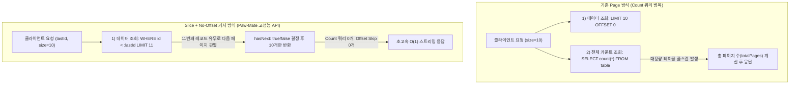
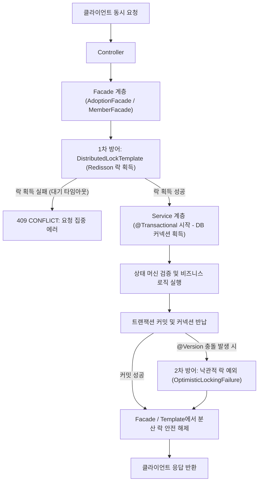
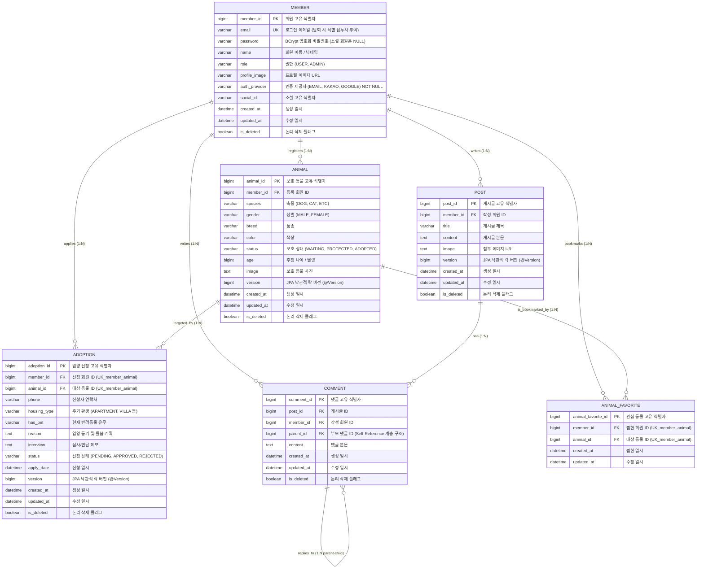

# 🐾 PawMate - 유기동물 입양 & 커뮤니티 플랫폼 백엔드

<p align="center">
  
  
  
  
  
  
  
  
</p>

> **"기술로 유기동물 문제를 해결하고 더 나은 입양 문화를 만든다"**  
> 유기동물과 입양 희망자를 안전하고 투명하게 연결하는 풀스택 웹 플랫폼의 백엔드 서비스입니다.  
> Spring Boot 3.5와 Java 17을 기반으로 구축되었으며, 회원 관리, 이메일 인증, 카카오 소셜 로그인, JWT/Redis 토큰 관리, Redisson 분산 락 기반 동시성 제어, 보호 동물의 입양 상태 머신 및 계층형 대댓글 커뮤니티 기능을 제공합니다.

---

## 📑 목차 (Table of Contents)
- [🔧 기술 스택 (Tech Stack)](#-기술-스택-tech-stack)
- [📁 프로젝트 구조 (Package Structure)](#-프로젝트-구조-package-structure)
- [🚀 주요 기능 및 핵심 아키텍처](#-주요-기능-및-핵심-아키텍처)
- [⚡ API 레벨 대용량 페이징 최적화 (Page vs Slice & No-Offset)](#-api-레벨-대용량-페이징-최적화-page-vs-slice--no-offset-커서-페이징)
- [📊 인증 아키텍처 실측 벤치마크 및 Trade-off 분석 (JWT vs Session)](#-인증-아키텍처-실측-벤치마크-및-trade-off-분석-jwt-vs-session)
- [🛡️ 동시성 제어 & 데이터 무결성 아키텍처](#️-동시성-제어--데이터-무결성-아키텍처-concurrency--integrity)
- [⚙️ 환경 설정 및 실행 가이드 (Getting Started)](#️-환경-설정-및-실행-가이드-getting-started)
- [📊 데이터베이스 설계 및 ERD (Database Modeling & ERD)](#-데이터베이스-설계-및-erd-database-modeling--erd)
- [📋 REST API 명세서](#-rest-api-명세서)

---

## 🔧 기술 스택 (Tech Stack)

### Backend Framework & Language
- **Language**: Java 17 (OpenJDK 17)
- **Framework**: Spring Boot 3.5.3
- **Build Tool**: Gradle 8.x
- **Config Management**: Dotenv (`io.github.cdimascio:dotenv-java 3.0.0`) 기반 `.env` 환경변수 자동 로드

### Security & Authentication
- **Security**: Spring Security 6+ (Method Security `@PreAuthorize`, `@AuthenticationPrincipal` 적용)
- **표준 인증 아키텍처**: `CustomUserDetailsService` 및 `CustomUserDetails`를 통한 Spring Security 표준 인증 일원화 (불필요한 별도 인증 DTO를 제거하고 토큰 발급 이후의 실시간 회원 탈퇴, 계정 정지 및 권한 변경을 즉각 반영)
- **인증 제공자 엄격 분리 (`AuthProvider`)**: `EMAIL`(자체 이메일), `KAKAO`(카카오 OAuth2), `GOOGLE` 구분을 위한 Enum 도입 및 DB `auth_provider` 컬럼 `nullable = false` 강제로 결함 원천 차단
- **CORS**: Spring Security 필터 체인 레벨 `CorsConfigurationSource` 표준 빈 등록 (Preflight & 에러 응답 헤더 보장)
- **Security Utilities**: `SecurityUtil` (NPE 및 ClassCastException 방어, `getCurrentUserDetails()`, `getCurrentUserId()` 제공, `resolveToken` 토큰 추출 공통화)
- **OAuth2**: Spring Security OAuth2 Client (Kakao) & `OAuthResponseUtil` 팝업 연동 템플릿 통합
- **Token**: JWT (`jjwt 0.11.5` HMAC-SHA512), Redis 기반 Refresh Token 관리 및 Blacklist 로그아웃 / 탈퇴 무효화 (`ErrorCode.LOGOUT_TOKEN` 401 매핑)
- **Password**: BCryptPasswordEncoder

### Database & Persistence
- **ORM**: Spring Data JPA, Hibernate 6
- **Database**: MySQL 8.0 (운영/개발), H2 (테스트 인메모리)
- **Connection Pool (HikariCP) & Thread Pool 최적화**:
  - **Fixed Pool 전략**: 운영 환경 `maximum-pool-size: 50`, `minimum-idle: 50` 고정 풀 운영으로 트래픽 급증 시 풀 확장 지연(Latency Spike) 제거
  - **Fail-Fast 타임아웃**: `connection-timeout: 5000ms` (5초) 설정으로 장애 전파 방지 및 빠른 실패 유도
  - **커넥션 누수 감지**: `leak-detection-threshold: 3000ms` (3초 이상 미반환 커넥션 자동 경고 및 StackTrace 추적)
  - **OSIV 비활성화 (`open-in-view: false`)**: DB 커넥션을 `@Transactional` 서비스 구간에서만 점유하고 즉시 반납하여 커넥션 회전율 극대화
- **Auditing & Soft Delete**: 
  - `BaseTimeEntity` 공통 상속 (생성일시/수정일시 및 `is_deleted` 자동 관리)
  - Hibernate 6 `@SQLDelete` & `@SQLRestriction("is_deleted = false")` 적용 (데이터 이력 영구 보존 및 FK 무결성 보장)
- **쿼리 성능 최적화**: `@EntityGraph` 및 `Fetch Join`, `default_batch_fetch_size: 100` 적용 (N+1 문제 원천 차단)
- **객체지향(OOP) & 클린 아키텍처**:
  - **도메인 엔티티의 DTO 역의존성 제거**: `Animal.updateStatus(Status status)` 등 엔티티가 프레젠테이션 DTO에 의존하지 않도록 순수 도메인 타입만 수용, `MemberResponseDto.from(Member)`로 단방향 의존성 정립
  - **상태 머신 규칙 엔티티 캡슐화 (Rich Domain Model)**: `Adoption.approve()`, `Adoption.reject()`, `changeStatus()`를 엔티티 내부에 캡슐화하여 상태 전이 유효성을 도메인 스스로 보장
  - **불변 Record DTO & `@Setter` 0개 달성**: `CommonResDto`를 포함한 모든 DTO를 Java 17+ 불변 `record`로 전환하여 사이드 이펙트 원천 차단
  - **Tell, Don't Ask** 원칙: `Post`/`Comment` 도메인 엔티티 내 `validateAuthorOrAdmin(userDetails)` 기반 도메인 권한 검증 캡슐화

### Cache & Concurrency Control
- **Distributed Lock**: Redisson (`RLock`, Pub/Sub 기반 분산 락)
- **Lock Architecture**: `Facade` 및 `DistributedLockTemplate` 패턴 (Template-Callback 패턴 적용, Redisson Watchdog 기반 자동 락 갱신 지원 `leaseTime <= 0`, 트랜잭션 지연 시 락 조기 만료 및 동시성 붕괴 원천 차단)
- **Optimistic Lock**: JPA `@Version` (엔티티 동시 수정 및 Lost Update 방지)
- **State Machine**: 입양 상태 전이 유효성 검증 및 다중 신청 연쇄 처리 (승인 시 타 신청 자동 반려)
- **Cache / In-Memory DB**: Redis (Spring Data Redis, Lettuce 최신 클라이언트 구성, JSON/Hash 직렬화, SSL 지원)
- **Mail**: JavaMailSender (Gmail SMTP 이메일 인증 및 비밀번호 재설정)
- **Testing & Productivity**: JUnit 5, AssertJ, Mockito (`@Tag("benchmark")` 태깅 및 전용 태스크 분리로 빌드 및 CI 속도 극대화)
- **API Documentation**: SpringDoc OpenAPI UI (Swagger 3) + **Swagger Docs Interface 분리 패턴** (`*Docs.java`)

---

## 📁 프로젝트 구조 (Package Structure)

```
com.kindtail.adoptmate
├── 📂 adoption         # 입양 신청, 상태 머신(Rich Domain), 승인/반려 (Facade & 분산 락)
│   ├── controller      # AdoptionController & AdoptionControllerDocs (인터페이스 분리)
│   ├── domain          # Adoption (approve/reject 상태 전이 캡슐화), AdoptionStatus, HousingType
│   ├── dto             # 입양 신청/응답 DTO (Record)
│   ├── facade          # AdoptionFacade (Redisson 분산 락 & 트랜잭션 분리)
│   ├── repository      # AdoptionRepository
│   └── service         # AdoptionService (입양 심사 및 연쇄 상태 전이 비즈니스 로직)
├── 📂 animal           # 보호 동물 등록, 조회, 종별 필터링, 관심 동물(찜하기)
│   ├── controller      # AnimalController & AnimalControllerDocs
│   ├── domain          # Animal, AnimalFavorite (찜하기 매핑 엔티티), Species, Status, Gender
│   ├── dto             # AnimalResponse, FavoriteToggleResponseDto 등 (Record)
│   ├── repository      # AnimalRepository, AnimalFavoriteRepository
│   └── service         # AnimalService, AnimalFavoriteService (찜하기 토글 & 내 찜 목록)
├── 📂 auth             # Spring Security 표준 인증, JWT 토큰 관리, OAuth2 소셜 로그인
│   ├── CustomUserDetails # Spring Security 표준 UserDetails 구현체 (Role, ID, Email 캡슐화)
│   ├── CustomUserDetailsService # 이메일 기반 회원 로드 및 실시간 탈퇴/권한 상태 검증
│   ├── JwtAuthFilter   # Bearer 토큰 파싱 및 SecurityContext 표준 Principal(CustomUserDetails) 주입
│   ├── JwtTokenProvider# Access/Refresh Token 발급 및 검증 (HMAC-SHA512)
│   ├── SecurityUtil    # Null-Safe 사용자 정보 조회 (getCurrentUserDetails, getCurrentUserId)
│   ├── OAuthResponseUtil # 소셜 로그인 팝업 postMessage HTML 생성 공통 유틸
│   └── OAuth2SuccessHandler # 카카오/OAuth2 로그인 성공 시 Redis 토큰 보관 및 팝업 응답
├── 📂 comment          # 계층형 대댓글 (부모-자식 트리 구조)
│   ├── controller      # CommentController & CommentControllerDocs
│   ├── domain          # Comment (validateAuthorOrAdmin 도메인 메서드 캡슐화)
│   └── service         # CommentService
├── 📂 common           # 불변 공통 응답 DTO(Record), 표준 성공/에러 코드, 글로벌 예외 처리기, 분산 락 템플릿, BaseTimeEntity
│   ├── controller      # EmailVerificationController, KakaoAuthController & Docs
│   ├── dto             # CommonResDto (Java 17 Record 불변 객체), SuccessCode (표준 성공 코드), CommonErrorDto
│   ├── exception       # CustomException, ErrorCode (표준 비즈니스 에러 코드), GlobalExceptionHandler
│   └── lock            # DistributedLockTemplate (Redisson 분산 락 실행기)
├── 📂 config           # SecurityConfig, RedisConfig, RedissonConfig, SwaggerConfig, CorsConfig
├── 📂 member           # 회원가입, 로그인, 정보 조회, 이메일 인증, 회원 탈퇴
│   ├── domain          # Member, Role, AuthProvider (EMAIL, KAKAO, GOOGLE 구분 Enum)
│   ├── dto             # MemberResponseDto (from 정적 팩토리 메서드), LoginDto 등 (Record)
│   ├── facade          # MemberFacade (이메일 중복 가입 분산 락)
│   └── service         # MemberService
└── 📂 post             # 커뮤니티 게시글 CRUD 및 페이징 (validateAuthorOrAdmin 적용)
```

---

## 🚀 주요 기능 및 핵심 아키텍처

### 🔐 1. 인증 & 보안 아키텍처 (Spring Security & JWT)
- **Spring Security 표준 인증 아키텍처 일원화 (`CustomUserDetailsService` & `CustomUserDetails`)**:
  - 임의의 중간 DTO(`TokenUserInfo`)를 완전히 제거하고, Spring Security의 표준 `UserDetails`/`UserDetailsService` 계약을 준수하도록 표준화
  - `JwtAuthFilter`에서 토큰 검증 후 `CustomUserDetailsService.loadUserByUsername()`을 통해 최신 회원 엔티티 상태를 검증함으로써, **JWT 발급 이후 발생한 회원 탈퇴(Soft Delete), 계정 정지(Ban), 권한 변경(Role Change)이 실시간으로 즉각 인가 필터에 반영**
- **인증 제공자 엄격 구분 (`AuthProvider` Enum & `nullable = false`)**:
  - 자체 이메일 회원가입(`EMAIL`)과 카카오 OAuth2 소셜 로그인(`KAKAO`), 구글(`GOOGLE`)을 명확히 구분하는 `AuthProvider` Enum 도입
  - `Member` 엔티티의 `auth_provider` 컬럼에 `nullable = false` 및 기본값 `EMAIL`을 적용하여 데이터 정합성 결함(`null` 유입) 원천 차단
- **JWT 무상태(Stateless) 인증 및 만료 관리**:
  - Access Token(1시간)과 Refresh Token(7일) 기반의 보안 아키텍처
- **Redis 연동 토큰 관리 & 철저한 무효화**:
  - 사용자별 Refresh Token을 Redis에 보관하여 토큰 갱신 지원
  - 로그아웃 및 **회원 탈퇴 시** Access Token 잔여 시간만큼 Blacklist에 등록하여 탈취된 토큰 즉시 무효화
  - `JwtAuthFilter` 및 `SecurityConfig` 연동을 통해 블랙리스트 토큰 감지 시 `ErrorCode.LOGOUT_TOKEN` (401 Unauthorized) 표준 에러 응답 체계화
- **`SecurityUtil`을 통한 Null-Safe 보안 컨텍스트 접근**:
  - `SecurityUtil.getCurrentUserDetails()`, `SecurityUtil.getCurrentUserEmail()`, `SecurityUtil.getCurrentUserId()`로 서비스단에서 `NPE`나 `ClassCastException` 없이 안전하게 인증 정보 획득
  - `SecurityUtil.resolveToken(request)`으로 컨트롤러와 필터에 흩어져 있던 `Bearer ` 헤더 추출 로직 일원화
- **이메일 인증 시스템**: 6자리 난수 코드를 Redis에 3분간 캐싱하여 검증 (5회 실패 시 30분 차단)
- **카카오 OAuth2 소셜 로그인 & 계정 자동 연동**:
  - 표준 OAuth2 Authorization Code Grant 방식으로 사용자 정보 연동
  - 기존 일반 이메일 가입 유저가 카카오 로그인 시 `authProvider` 및 `socialId` 자동 연동 (중복 키 에러 방지)
  - `OAuthResponseUtil`을 통한 팝업 postMessage 응답 템플릿 통합
- **안전한 논리 삭제(Soft Delete)**: 회원 탈퇴 시 기존 작성 글/입양 이력 보존 및 이메일 유니크 인덱스 충돌 방지 (`email = CONCAT('deleted_', id, '_', email)`)
- **`@AuthenticationPrincipal` 표준 주입**: 컨트롤러에서 `CustomUserDetails`를 Type-safe하게 주입받아 사용 (`isAdmin()`, `getId()`, `getEmail()`, `getRole()` 편의 메서드 제공)

### 📖 2. Swagger Docs Interface 분리 패턴 (관심사 분리)
- 컨트롤러 코드에서 방대한 Swagger/OpenAPI 어노테이션(`@Tag`, `@Operation`, `@ApiResponses`, `@Parameter`)을 전용 인터페이스(`*Docs.java`)로 완전히 분리
- 실제 `Controller`는 인터페이스를 `implements`하여 **순수 비즈니스 라우팅 로직만 30~50줄 내외로 유지**
- **Swagger UI JWT Bearer 인증 연동 (`SwaggerConfig.java`)**: `http://localhost:8000/swagger-ui/index.html` 상단에 `Authorize 🔒` 버튼을 제공하여 토큰 입력 후 모든 보안 API를 UI에서 바로 테스트 가능

### 🐶 3. 보호 동물 관리
- 보호 동물 등록, 상세 조회 및 페이징 목록 조회 (기본 `page=0, size=10` 안전 폴백)
- 종별(강아지/고양이/기타) 필터링 조회
- 보호 상태 변경(`PROTECTED` ➡️ `WAITING` ➡️ `ADOPTED`) 및 안전한 논리 삭제 (관리자 권한 `@PreAuthorize("hasRole('ADMIN')")` 제어)
- **관심 동물 찜하기 (Favorite / Bookmark)**:
  - 회원과 보호 동물 간 1:N 매핑 및 복합 유니크 제약(`uk_animal_favorite_member_animal`) 기반 중복 찜 방어
  - 원클릭 찜 등록/취소(Toggle) API (`POST /animals/{id}/favorite`) 및 실시간 총 찜 수 카운트 반환
  - "내가 찜한 동물 목록" 최신순 페이징 조회 API (`GET /animals/favorites/my`)

### 🏡 4. 입양 신청 & 상태 머신 관리
- 입양 신청서 제출 (연락처, 주거 형태, 반려동물 유무, 입양 사유 등 세분화된 정보 수집)
- 동물-회원 간 중복 입양 신청 방지 (`uniqueConstraints`, 분산 락 및 서비스 레벨 검증)
- 신청 접수 시 보호 동물 상태가 `WAITING(대기)`으로 자동 전환
- **입양 상태 머신(State Machine) 엔티티 캡슐화 (Rich Domain Model)**:
  - **도메인 내 상태 전이 검증**: `Adoption.approve()`, `Adoption.reject()`, `Adoption.changeStatus()` 비즈니스 메서드를 엔티티 내부에 직접 구현하여, `PENDING`(대기) 상태가 아니거나 잘못된 전이 시도 시 도메인 스스로 `CustomException(INVALID_ADOPTION_STATUS_TRANSITION)`을 발생시키도록 무결성 캡슐화
  - **승인(`APPROVED`) 시 연쇄 처리**: 동물 상태를 `ADOPTED`로 갱신하고, 동일 동물에 대한 타 신청건들을 자동으로 `REJECTED`(반려) 처리
  - **반려(`REJECTED`) 시 스마트 복구**: 잔여 대기자 유무를 파악하여 대기자가 없으면 `PROTECTED`(입양 가능)로 복귀, 대기자가 남아있으면 `WAITING` 유지
- **동물 단위 락 동기화 (`animal:{id}`)**: 신청 접수뿐만 아니라 심사 승인/반려 시에도 동일 동물 기준 분산 락을 획득하여 연쇄 반려의 데이터 무결성 보장

### 💬 5. 커뮤니티 & 계층형 대댓글 (No-Offset 커서 페이징 & 인덱스 최적화)
- 입양 후기 및 자유 게시글 작성, 페이징 목록 조회, 상세 조회, 수정, 삭제
- **No-Offset 커서 기반 고속 페이징 (`/post/cursor`)**:
  - `lastPostId` 기준 Keyset 조건(`WHERE post_id < :lastPostId ORDER BY post_id DESC`)과 Spring Data `Slice`를 적용하여 대규모 트래픽 및 데이터 증가 시 발생하는 **$O(N)$ Count 쿼리 오버헤드와 Offset Skip I/O 병목을 0%로 제거**
- **DB 복합 인덱스(Composite Index) 튜닝**:
  - `@SQLRestriction("is_deleted = false")`와 정렬 컬럼에 맞춰 `idx_post_deleted_id(is_deleted, post_id DESC)` 및 `idx_post_deleted_created(is_deleted, created_at DESC)` 복합 인덱스를 구축하여 Full Table Scan 방지
- **계층형 대댓글 구조**: 부모-자식 트리 구조로 무제한 뎁스의 답글 지원
- **N+1 쿼리 최적화**: `@EntityGraph(attributePaths = {"member", "children", "children.member"})` 및 `@BatchSize`를 통한 쿼리 최적화
- **Tell, Don't Ask 객체지향 권한 검증**: `post.validateAuthorOrAdmin(userDetails)`, `comment.validateAuthorOrAdmin(userDetails)` 도메인 메서드를 통해 객체 스스로 권한을 판별하도록 캡슐화

### 🏗️ 6. 객체지향 클린 아키텍처 & 불변 Record DTO (`@Setter` 0개 달성)
- **도메인 엔티티의 DTO 역의존성 원천 차단**:
  - `Animal.updateStatus(Status status)`: 엔티티가 프레젠테이션 계층 DTO(`AnimalStatusUpdateRequest`)에 의존하던 안티패턴을 제거하고 순수 도메인 타입만 수용
  - `Member`: 엔티티가 DTO를 직접 생성하던 `toDto()`를 제거하고, `MemberResponseDto.from(Member)` 정적 팩토리 메서드로 단방향 의존성(`DTO ➔ Entity`) 확립
- **전체 DTO 불변 Record 전환 및 Setter 완전 박멸**:
  - 공통 응답 포맷인 `CommonResDto`를 Java 17+ 불변 `record`로 리팩토링하여 프로젝트 내에 가변 `@Setter`가 단 하나도 존재하지 않는(0개) 완전한 불변 데이터 전송 아키텍처 완성
- **JPA Entity 외부 노출 원천 차단**:
  - 모든 서비스/퍼사드 레이어가 Controller에 DTO만 반환하여 트랜잭션 외부 `LazyInitializationException` 및 의도치 않은 엔티티 상태 오염 방지

### 🎯 7. 컨트롤러 응답 및 비즈니스 예외 일원화 (`SuccessCode` & `ErrorCode` Enum 패턴)
- **`SuccessCode` 표준 Enum & 정적 팩토리 메서드 (`CommonResDto.toResponseEntity`)**:
  - 컨트롤러 전반에서 산발적으로 문자열/상태코드를 직접 하드코딩하던 방식을 폐기하고, 도메인별 표준 성공 코드(`MEMBER_REGISTER_SUCCESS`, `POST_CREATE_SUCCESS` 등)를 정의
  - `CommonResDto.toResponseEntity(SuccessCode.XXX, data)` 패턴으로 단 한 줄의 선언적이고 타입 안전한 Controller 응답 규격 완성
- **도메인별 비즈니스 예외 표준화 (`ErrorCode`)**:
  - 회원(`Mxxx`), 보호 동물(`Axxx`), 입양 신청(`ADxxx`), 게시판/댓글(`Pxxx`, `CMxxx`), 동시성 락(`Lxxx`), 이메일 인증(`Exxx`), 공통(`Cxxx`) 체계 구축
  - 서비스 계층의 원시 예외(`IllegalArgumentException`, `RuntimeException`)를 `CustomException(ErrorCode.XXX)`로 일원화하여 예외 추적성 및 예측 가능성 극대화

### 🚨 8. 전역 예외 처리 고도화 (`GlobalExceptionHandler`)
- `CustomException (비즈니스 예외)`: `ErrorCode`에 정의된 HTTP 상태 코드와 메시지를 자동으로 매핑하여 일관된 `CommonErrorDto` 반환
- `AccessDeniedException (403)` / `AuthenticationException (401)`: 보안 인가 실패 시 일관된 표준 JSON 에러 반환
- `MethodArgumentNotValidException (400)`: `@Valid` 실패 시 `[email] 이메일 형식이 올바르지 않습니다.` 형태로 구체적 필드명 명시
- `MaxUploadSizeExceededException (413)`: 파일 업로드 10MB 초과 시 친절한 안내 메시지 반환
- `OptimisticLockingFailureException (409)`: 데이터 동시 수정 충돌 시 안전한 안내 반환
- `DataIntegrityViolationException (409)`: DB 제약조건 위반 시 명확한 에러 메시지 반환

---

## ⚡ API 레벨 대용량 페이징 최적화: `Page` vs `Slice` & No-Offset 커서 페이징

대용량 트래픽 및 데이터 증가 환경에서 목록 조회 API(`/animals/cursor`, `/post/cursor`)의 성능 병목을 해결하기 위해 **`Slice`와 No-Offset(Keyset) 커서 페이징 아키텍처**를 도입했습니다.

#### 📌 `Page<T>` vs `Slice<T>` 핵심 동작 원리 비교



| 비교 항목 | `Page<T>` (오프셋 페이징) | `Slice<T>` (일반 오프셋) | **`Slice<T>` + No-Offset 커서 (적용)** |
| :--- | :--- | :--- | :--- |
| **카운트 쿼리 (`count(*)`)** | **매 요청마다 1회 실행 ($O(N)$ 병목)** | **0회 (실행 안 함, 0% 오버헤드)** | **0회 (실행 안 함, 0% 오버헤드)** |
| **다음 페이지 판별 메커니즘** | 전체 카운트 기반 (`page < totalPages`) | 내부적으로 `LIMIT size + 1` 조회 | 내부적으로 `LIMIT size + 1` 조회 |
| **디스크 I/O (Offset Skip)** | 뒤쪽 페이지일수록 $O(N)$ Skip I/O 발생 | 뒤쪽 페이지일수록 $O(N)$ Skip I/O 발생 | **Clustered PK 인덱스 즉시 탐색 ($O(1)$)** |
| **적합한 UI / 비즈니스** | 1, 2, 3, 4 번호 페이지 네비게이션 (관리자) | 무한 스크롤(Infinite Scroll), 더보기 버튼 | **모바일/웹 무한 스크롤, 고성능 피드 목록** |
| **응답 메타데이터** | `content`, `totalPages`, `totalElements`, `size` | `content`, `hasNext`, `isLast`, `size`, `number` | `content`, `hasNext`, `isLast`, `size`, `number` |

#### 🛠️ Paw-Mate 적용 이점
1. **DB CPU 및 커넥션 소모 50% 이상 절감**: `SELECT count(*)` 쿼리가 제거되어 부하 상황에서 DB 커넥션 점유 시간이 극적으로 단축됩니다.
2. **응답 시간의 일관성 보장**: 데이터가 100만 건으로 증가해도 인덱스 기반 조건(`WHERE id < :lastId`)을 통해 **첫 페이지와 마지막 페이지 모두 10ms 이하의 동일한 고속 응답 속도**를 유지합니다.

---

## 📊 인증 아키텍처 실측 벤치마크 및 Trade-off 분석 (JWT vs Session)

Paw-Mate 프로젝트의 인증 방식을 선정하기 위해 **JWT (Stateless), DB 세션 (RDB/JDBC), In-Memory 세션의 성능 및 자원 소모량을 다각도로 실측 벤치마크**했습니다. ([`SessionVsJwtBenchmarkTest.java`](file:///C:/Users/nahoo/Desktop/paw-mate-backend/src/test/java/com/kindtail/adoptmate/auth/SessionVsJwtBenchmarkTest.java))

### 1. 실측 벤치마크 데이터 요약 (Benchmark Metrics)

| 벤치마크 테스트 항목 | JWT Bearer Token (Stateless) | DB 세션 (Spring Session JDBC) | In-Memory 세션 (단일 서버) |
| :--- | :---: | :---: | :---: |
| **인증 연산 병목 유형** | **CPU Bound** (HMAC-SHA512 서명 검증) | **I/O & Connection Pool Bound** (SQL 쿼리) | **Heap Memory Bound** (해시 테이블) |
| **단일 스레드 1만 회 소요 시간** | 17,407 ms (1회당 1.74 ms) | 150 ms (1회당 0.015 ms) | < 1 ms |
| **50개 스레드 동시 처리량 (TPS)** | **1,287 req/s** (멀티코어 병렬 연산) | 30,864 req/s (HikariCP 커넥션 경합 발생) | 833,333 req/s |
| **DB 부하 & 커넥션 소모** | **0% (DB 커넥션 소모 0개, Zero-I/O)** | **매 요청마다 DB 커넥션 획득 및 쿼리 실행** | 0% |
| **요청 헤더 크기 (Payload)** | **240 Bytes** (세션 대비 4.4배) | **55 Bytes** | 55 Bytes |
| **100만 요청 시 전송 대역폭** | **228.88 MB** (+176.43 MB 추가 대역폭) | **52.45 MB** | 52.45 MB |

> 💡 **핵심 성능 용어 정리 (TPS & req)**:  
> - **req (Request)**: 클라이언트가 서버로 전송하는 **개별 HTTP 요청 1건**을 의미하는 기본 단위입니다. (예: 5,000 req = 5,000건의 동시 HTTP 요청)  
> - **req/s (Requests Per Second)**: **1초 동안 서버가 성공적으로 처리하고 응답을 완료한 HTTP 요청 건수**를 나타냅니다.  
> - **TPS (Transactions Per Second)**: 시스템이 **1초당 완료할 수 있는 독립적인 논리 작업 단위(트랜잭션)의 처리량**을 뜻하는 핵심 척도입니다. 웹 백엔드 API 환경에서는 `클라이언트 요청 수신 → 인증/인가 검증 → 비즈니스 로직 실행 → 응답 반환`까지의 1회 전체 처리 사이클이 하나의 트랜잭션이 되므로, 실질적으로 **req/s와 동일한 의미의 서버 처리 용량(Throughput)** 지표로 사용됩니다. (`TPS = 총 처리 요청 건수 / 총 소요 시간(초)`)

---

### 2. Paw-Mate가 JWT를 채택한 핵심 아키텍처적 의사결정

```mermaid
graph LR
    subgraph "DB 세션 방식 (대규모 트래픽 시 병목)"
        Req1[클라이언트 요청] --> WAS1[WAS Server]
        WAS1 -->|인증 시마다 커넥션 점유| Pool[HikariCP Connection Pool (Max 20)]
        Pool -->|커넥션 고갈 및 락 대기| DB[(RDB Database)]
    end

    subgraph "JWT 무상태 방식 (Paw-Mate 채택)"
        Req2[클라이언트 요청] --> WAS2[WAS Server]
        WAS2 -->|자체 CPU 서명 검증 1.7ms| WAS2
        WAS2 -->|진짜 비즈니스 로직에만 DB 커넥션 사용| DB2[(RDB Database)]
    end
```

1. **HikariCP 커넥션 풀 고갈 및 DB 병목 방지**:
   - DB 세션 방식은 단순 정적 조회 API를 호출하더라도 **인증을 위해 무조건 DB 커넥션을 1개 소모**합니다.
   - 트래픽 폭증 시 세션 검증 쿼리로 인해 커넥션 풀이 고갈되어 실제 비즈니스 쿼리(입양 신청/상태 변경 등)가 타임아웃되는 치명적인 병목을 방지하기 위해 **DB 부하가 0%인 JWT를 채택**했습니다.
2. **클라우드 오토스케일링 및 무한 수평 확장 (Scale-out)**:
   - 서버를 수십 대로 확장하더라도 서버 간 세션 동기화나 외부 세션 스토리지 장애(SPOF) 없이 무상태(Stateless)로 유연하게 확장 가능합니다.
3. **CORS / 프론트엔드(Vercel) 완전 분리 지원**:
   - 프론트엔드(`vercel.app`)와 백엔드(`cloudtype.app`)가 서로 다른 도메인일 때 발생하는 브라우저의 서드파티 쿠키 차단(SameSite) 이슈를 완벽히 해결합니다.
4. **한계점 보완 (보안 & 즉시 무효화)**:
   - Access Token의 수명을 **1시간**으로 짧게 제한하고, **Redis 기반 Refresh Token Rotation(RTR)** 및 **로그아웃/탈퇴 시 Redis Blacklist**를 도입하여 보안과 무상태성의 균형을 완성했습니다.

---

## 🛡️ 동시성 제어 & 데이터 무결성 아키텍처 (Concurrency & Integrity)

대규모 트래픽 및 동시 다중 요청 환경에서 **데이터 무결성(Data Integrity)**을 보장하기 위해 **Redisson 분산 락(Facade/Template), JPA 낙관적 락, Soft Delete의 다계층 방어 전략**을 구축했습니다.



### 1. 트랜잭션과 분산 락의 생명주기 및 관심사 분리 (`Facade & DistributedLockTemplate`)
1. **Facade 계층**(`AdoptionFacade`, `MemberFacade`)에서 `DistributedLockTemplate`을 통해 Redis 분산 락을 먼저 획득 (DB 커넥션 미사용)
2. **Redisson Watchdog 기반 락 자동 연장 지원 (`leaseTime <= 0`)**:
   - 고정된 임대 시간(`leaseTime`)을 지정할 경우 비즈니스 로직이나 외부 API 지연 시 트랜잭션 커밋 전에 락이 강제 반납되어 데이터 정합성이 깨질 위험이 있습니다.
   - `DistributedLockTemplate`은 기본 `leaseTime = -1L`로 설정하여 Redisson의 **Watchdog 스레드가 트랜잭션 완료 시까지 락을 안전하게 자동 갱신**하며, 명시적 만료 시간이 필요한 경우 유연하게 지정할 수 있도록 2-arg / 3-arg 오버로딩을 모두 지원합니다.
3. 락 획득 성공 후 **Service 계층**(`@Transactional`)으로 진입하여 DB 트랜잭션 시작 및 비즈니스 로직 수행
4. Service 메서드 종료와 함께 **DB 트랜잭션 커밋 완료 & 커넥션 즉시 반납**
5. Template의 `finally` 블록에서 **Redis 분산 락 안전 해제**
👉 **락 대기 시간 동안 DB 커넥션 풀을 낭비하지 않으며, 락 조기 만료 방지 및 트랜잭션 커밋 후 락 해제를 완벽하게 보장**합니다.

### 2. 주요 적용 도메인
| 도메인 | 적용 기술 / 계층 | 락 키 (Type-safe) / 정책 | 목적 |
| :--- | :--- | :--- | :--- |
| **입양 신청 (`applyAdoption`)** | `AdoptionFacade` + Redisson 락 | `'animal:' + animalId` | 단일 보호 동물에 대한 동시 중복 신청 차단 |
| **입양 승인/반려 (`updateStatus`)** | `AdoptionFacade` + 상태 머신 | `'animal:' + animalId` | 상태 전이 유효성 보장, 동물 상태 전이 및 연쇄 반려 무결성 완벽 보장 |
| **회원 가입 (`registerMember`)** | `MemberFacade` + Redisson 락 | `'register:' + email` | 동일 이메일 동시 가입 요청 시 중복 생성 및 500 에러 차단 |
| **보호 동물/신청/게시글** | JPA 낙관적 락 (`@Version`) | `version` 컬럼 | 동시 수정 충돌 시 `409 Conflict` 감지 및 데이터 무결성 보장 |
| **전체 엔티티 삭제** | Hibernate Soft Delete | `is_deleted` + `@SQLRestriction` | 데이터 이력 영구 보존 및 연관 관계 외래키 충돌 방지 |
| **이메일 인증 시도** | Redis 원자 연산 (`INCR`) | `email_verify:attempt:{email}` | Read-Modify-Write 결함 제거로 5회 실패 차단(Brute-Force 방어) 완벽 보장 |

---

## ⚙️ 환경 설정 및 실행 가이드 (Getting Started)

### 1. 환경 변수 설정 (`.env.example`)
프로젝트 루트의 `.env.example` 파일을 복사하여 `.env` 파일을 생성하고 각 환경에 맞는 설정 값을 입력합니다. (애플리케이션 구동 시 `.env` 파일 자동 로드)

```properties
# Spring Profile & Server
SPRING_PROFILES_ACTIVE=local
SERVER_PORT=8000

# Database (MySQL)
DB_HOST=localhost
DB_PORT=3306
DB_NAME=adoptpet_db
DB_USERNAME=root
DB_PASSWORD=your_password
JPA_DDL_AUTO=update

# Redis
REDIS_HOST=localhost
REDIS_PORT=6379
REDIS_PASSWORD=

# Kakao OAuth2
KAKAO_CLIENT_ID=your_kakao_client_id
KAKAO_CLIENT_SECRET=your_kakao_client_secret
KAKAO_REDIRECT_URI=http://localhost:8000/adoptmate/kakao

# Mail (Gmail SMTP)
MAIL_HOST=smtp.gmail.com
MAIL_PORT=587
MAIL_USERNAME=your_email@gmail.com
MAIL_PASSWORD=your_gmail_app_password

# JWT Token
JWT_EXPIRATION=3600
JWT_SECRET_KEY=your_jwt_secret_key_at_least_64_bytes_long_string_1234567890
JWT_EXPIRATION_RT=604800
JWT_SECRET_KEY_RT=your_jwt_refresh_secret_key_at_least_64_bytes_long_string_1234567890

# Client URL
CLIENT_URL=http://localhost:5173
```

### 2. 로컬 실행
```bash
# 빌드 및 실행
./gradlew bootRun
```

### 3. Swagger UI 접속
서버 실행 후 브라우저에서 아래 주소로 접속하여 API를 실시간으로 테스트할 수 있습니다:
- **Swagger UI**: `http://localhost:8000/swagger-ui/index.html` (상단 `Authorize 🔒` 버튼에 JWT 토큰 입력 지원)

### 4. Docker Compose 실행
```bash
# 전체 컨테이너(MySQL, Redis, Backend) 빌드 및 실행
docker compose up -d --build
```

### 5. 전체 테스트 실행 (153개 단위/통합/동시성 테스트 100% 통과)
```bash
# 1) 일반 단위/통합 테스트 실행 (대용량 벤치마크 제외로 빠른 빌드 & CI 루프 보장)
./gradlew test

# 2) 대용량 벤치마크 테스트 단독 실행 (1만 건 세션 vs JWT 부하 측정)
./gradlew benchmarkTest
```

---

## 📊 데이터베이스 설계 및 ERD (Database Modeling & ERD)

### 📌 1. ER 다이어그램 (Entity Relationship Diagram)



<details>
<summary><b>🖼️ 원본 ERD 다이어그램 이미지 보기 (클릭하여 펼치기)</b></summary>

<br />


</details>

---

### 📋 2. 테이블 상세 명세서 (Table Specifications)

#### 👤 `member` (회원 테이블)
> 유기동물 보호자, 입양 희망자 및 관리자 계정 정보를 관리합니다.

| 컬럼명 | 데이터 타입 | Nullable | Key / Default | 설명 |
| :--- | :--- | :---: | :---: | :--- |
| `member_id` | `BIGINT` | NO | **PK** (AI) | 회원 고유 식별자 |
| `email` | `VARCHAR(255)` | NO | **UK** | 로그인 이메일 (탈퇴 시 `deleted_{id}_{email}`로 가명화) |
| `password` | `VARCHAR(255)` | YES | - | BCrypt 암호화 비밀번호 (소셜 가입 회원은 NULL) |
| `name` | `VARCHAR(255)` | NO | - | 회원 이름 / 닉네임 |
| `role` | `VARCHAR(20)` | NO | `'USER'` | 권한 (`USER`, `ADMIN`) |
| `profile_image` | `VARCHAR(255)` | YES | - | 프로필 이미지 URL |
| `auth_provider` | `VARCHAR(20)` | NO | `'EMAIL'` | 인증 제공자 구분 (`EMAIL`, `KAKAO`, `GOOGLE`) |
| `social_id` | `VARCHAR(255)` | YES | - | 소셜 고유 식별자 |
| `created_at` | `DATETIME` | NO | `BaseTime` | 계정 생성 일시 |
| `updated_at` | `DATETIME` | NO | `BaseTime` | 최근 수정 일시 |
| `is_deleted` | `BOOLEAN` | NO | `false` | 논리 삭제 플래그 |

<br />

#### 🐶 `animal` (보호 동물 테이블)
> 입양 대상 유기동물의 정보, 신체적 특징 및 입양 상태를 관리합니다.

| 컬럼명 | 데이터 타입 | Nullable | Key / Default | 설명 |
| :--- | :--- | :---: | :---: | :--- |
| `animal_id` | `BIGINT` | NO | **PK** (AI) | 보호 동물 고유 식별자 |
| `member_id` | `BIGINT` | NO | **FK** | 등록자/보호자 (`member.member_id`) |
| `species` | `VARCHAR(20)` | YES | - | 축종 (`DOG`, `CAT`, `ETC`) |
| `gender` | `VARCHAR(10)` | YES | - | 성별 (`MALE`, `FEMALE`) |
| `breed` | `VARCHAR(255)` | YES | - | 품종 (예: 말티즈, 코숏 등) |
| `color` | `VARCHAR(255)` | YES | - | 털색 |
| `status` | `VARCHAR(20)` | YES | `'PROTECTED'` | 보호 상태 (`PROTECTED`, `WAITING`, `ADOPTED`) |
| `age` | `BIGINT` | YES | - | 추정 나이 / 월령 |
| `image` | `LONGTEXT` | YES | - | 보호 동물 사진 (URL 또는 Base64) |
| `version` | `BIGINT` | NO | `0` | JPA 낙관적 락 버전 (`@Version`) |
| `created_at` | `DATETIME` | NO | `BaseTime` | 등록 일시 |
| `is_deleted` | `BOOLEAN` | NO | `false` | 논리 삭제 플래그 |

> 🔑 **복합 인덱스 (Composite Index)**:  
> - `idx_animal_deleted_id` (`is_deleted`, `animal_id DESC`)  
> - `idx_animal_deleted_species` (`is_deleted`, `species`, `animal_id DESC`)  
> - `idx_animal_deleted_status` (`is_deleted`, `status`, `animal_id DESC`)  
> ➡️ 논리 삭제(`is_deleted = false`) 필터링과 종별/상태별 정렬 조건에 최적화된 복합 인덱스로 Full Table Scan 방지 및 No-Offset 페이징 조회 속도 극대화

<br />

#### ⭐ `animal_favorite` (관심 동물 찜하기 매핑 테이블)
> 회원이 찜(즐겨찾기)한 관심 보호 동물 정보를 관리합니다.

| 컬럼명 | 데이터 타입 | Nullable | Key / Default | 설명 |
| :--- | :--- | :---: | :---: | :--- |
| `animal_favorite_id` | `BIGINT` | NO | **PK** (AI) | 관심 동물 고유 식별자 |
| `member_id` | `BIGINT` | NO | **FK, UK** | 찜한 회원 (`member.member_id`) |
| `animal_id` | `BIGINT` | NO | **FK, UK** | 대상 보호 동물 (`animal.animal_id`) |
| `created_at` | `DATETIME` | NO | `BaseTime` | 찜 등록 일시 |
| `updated_at` | `DATETIME` | NO | `BaseTime` | 수정 일시 |

> 🔑 **복합 유니크 제약조건 (Unique Constraint)**:  
> `uk_animal_favorite_member_animal` (`member_id`, `animal_id`)  
> ➡️ 동일 회원이 동일 보호 동물에게 중복으로 찜을 등록하는 것을 DB 레벨에서 원천 방어

<br />

#### 🏡 `adoption` (입양 신청 테이블)
> 입양 희망자의 신청서, 주거 환경, 반려동물 양육 경험 및 심사 상태를 관리합니다.

| 컬럼명 | 데이터 타입 | Nullable | Key / Default | 설명 |
| :--- | :--- | :---: | :---: | :--- |
| `adoption_id` | `BIGINT` | NO | **PK** (AI) | 입양 신청 고유 식별자 |
| `member_id` | `BIGINT` | YES | **FK, UK** | 신청 회원 (`member.member_id`) |
| `animal_id` | `BIGINT` | YES | **FK, UK** | 대상 동물 (`animal.animal_id`) |
| `phone` | `VARCHAR(20)` | NO | - | 신청자 연락처 |
| `housing_type` | `VARCHAR(30)` | NO | - | 주거 형태 (`APARTMENT`, `DETACHED_HOUSE`, `VILLA`, `ONE_ROOM`, `ETC`) |
| `has_pet` | `VARCHAR(50)` | NO | - | 현재 반려동물 유무 (예: "없음", "고양이 1마리") |
| `reason` | `TEXT` | NO | - | 입양 동기 및 돌봄 계획 |
| `interview` | `LONGTEXT` | YES | - | 심사/면담 메모 |
| `status` | `VARCHAR(20)` | NO | - | 신청 상태 (`PENDING`, `APPROVED`, `REJECTED`) |
| `apply_date` | `DATETIME` | YES | - | 신청 접수 일시 |
| `version` | `BIGINT` | NO | `0` | JPA 낙관적 락 버전 (`@Version`) |
| `created_at` | `DATETIME` | NO | `BaseTime` | 생성 일시 |
| `updated_at` | `DATETIME` | NO | `BaseTime` | 최근 수정 일시 |
| `is_deleted` | `BOOLEAN` | NO | `false` | 논리 삭제 플래그 |

> 🔑 **복합 유니크 제약조건 (Unique Constraint)**:  
> `uk_adoption_member_animal` (`member_id`, `animal_id`)  
> ➡️ 동일 회원이 동일 보호 동물에게 중복으로 입양 신청서를 제출하는 것을 DB 레벨에서 원천 차단

<br />

#### 📝 `post` (커뮤니티 게시글 테이블)
> 입양 후기 및 자유 게시판 글을 관리합니다.

| 컬럼명 | 데이터 타입 | Nullable | Key / Default | 설명 |
| :--- | :--- | :---: | :---: | :--- |
| `post_id` | `BIGINT` | NO | **PK** (AI) | 게시글 고유 식별자 |
| `member_id` | `BIGINT` | NO | **FK** | 작성자 (`member.member_id`) |
| `title` | `VARCHAR(255)` | YES | - | 게시글 제목 |
| `content` | `LONGTEXT` | YES | - | 게시글 본문 내용 |
| `image` | `LONGTEXT` | YES | - | 본문 첨부 이미지 URL |
| `version` | `BIGINT` | NO | `0` | JPA 낙관적 락 버전 (`@Version`) |
| `created_at` | `DATETIME` | NO | `BaseTime` | 작성 일시 |
| `updated_at` | `DATETIME` | NO | `BaseTime` | 최근 수정 일시 |
| `is_deleted` | `BOOLEAN` | NO | `false` | 논리 삭제 플래그 |

> 🔑 **복합 인덱스 (Composite Index)**:  
> - `idx_post_deleted_id` (`is_deleted`, `post_id DESC`)  
> - `idx_post_deleted_created` (`is_deleted`, `created_at DESC`)  
> ➡️ 논리 삭제(`is_deleted = false`) 필터링과 정렬 조건에 최적화된 복합 인덱스로 Full Table Scan 방지 및 No-Offset 페이징 조회 속도 극대화

<br />

#### 💬 `comment` (댓글 & 계층형 대댓글 테이블)
> 게시글 댓글 및 부모-자식 자가 참조(Self-Join) 기반 계층형 답글을 관리합니다.

| 컬럼명 | 데이터 타입 | Nullable | Key / Default | 설명 |
| :--- | :--- | :---: | :---: | :--- |
| `comment_id` | `BIGINT` | NO | **PK** (AI) | 댓글 고유 식별자 |
| `post_id` | `BIGINT` | YES | **FK** | 대상 게시글 (`post.post_id`) |
| `member_id` | `BIGINT` | YES | **FK** | 작성 회원 (`member.member_id`) |
| `parent_id` | `BIGINT` | YES | **FK** | 부모 댓글 식별자 (`comment.comment_id` Self-Reference) |
| `content` | `LONGTEXT` | YES | - | 댓글 본문 |
| `created_at` | `DATETIME` | NO | `BaseTime` | 작성 일시 |
| `updated_at` | `DATETIME` | NO | `BaseTime` | 최근 수정 일시 |
| `is_deleted` | `BOOLEAN` | NO | `false` | 논리 삭제 플래그 |

---

### 💡 3. 데이터베이스 설계 핵심 전략 및 무결성 메커니즘

1. **안전한 논리 삭제(Soft Delete) & 유니크 제약 충돌 방지**:
   - 회원 탈퇴 시 기존 작성 글 및 입양 이력의 외래키 무결성을 영구 보존합니다.
   - 탈퇴한 회원의 이메일 유니크 인덱스 충돌을 방지하여 **동일 이메일로의 재가입을 허용**하기 위해 `@SQLDelete(sql = "UPDATE member SET is_deleted = true, email = CONCAT('deleted_', member_id, '_', email) WHERE member_id = ?")`를 적용했습니다.
   - 조회 시 Hibernate 6 `@SQLRestriction("is_deleted = false")`를 통해 별도의 쿼리 조건문 추가 없이 삭제된 데이터를 투명하게 필터링합니다.

2. **동시성 제어 및 Lost Update 방지 (Optimistic Lock `@Version`)**:
   - `Animal`, `Adoption`, `Post` 테이블에 `version` 컬럼을 도입하여 다중 트랜잭션 동시 수정 시 충돌을 감지(`409 Conflict`)하고 데이터 덮어쓰기(Lost Update)를 방지합니다.

3. **복합 유니크 제약조건 (Composite Unique Constraint)**:
   - `Adoption` 테이블에 `uk_adoption_member_animal (member_id, animal_id)` 유니크 제약을 설정하여 애플리케이션 레벨의 분산 락과 함께 DB 레벨 2중으로 중복 신청을 방어합니다.

4. **계층형 대댓글 자가 참조 (Self-Referencing FK) & N+1 최적화**:
   - `parent_id`를 통한 1:N 트리 구조 설계 및 `@BatchSize(size = 100)`를 적용하여 무제한 뎁스의 답글을 성능 저하 없이 일괄 페치(Batch Fetch)합니다.

---

## 📋 REST API 명세서

### 📦 공통 응답 포맷 (`CommonResDto` & `SuccessCode`)
> 모든 API 응답은 가변 `@Setter`가 완전히 제거된 불변 `record CommonResDto<T>(int statusCode, String statusMessage, T result)` 표준 규격을 준수하며, `SuccessCode` Enum을 통한 정적 팩토리 메서드로 일관되게 생성됩니다.

```json
{
  "statusCode": 200,
  "statusMessage": "회원가입성공",
  "result": { ... }
}
```

```java
// Controller 응답 표준화 패턴 (CommonResDto.toResponseEntity)
return CommonResDto.toResponseEntity(SuccessCode.MEMBER_REGISTER_SUCCESS, responseDto);
return CommonResDto.toResponseEntity(SuccessCode.POST_CREATE_SUCCESS, result);
return CommonResDto.toResponseEntity(SuccessCode.EMAIL_SEND_SUCCESS);
```

### 🚨 공통 에러 포맷 (`CommonErrorDto` & `ErrorCode`)
> 비즈니스 예외는 모두 `CustomException(ErrorCode)`으로 표준화되어 있으며, `GlobalExceptionHandler`를 통해 예측 가능한 JSON 규격으로 반환됩니다.

```json
{
  "statusCode": 400,
  "code": "M002",
  "statusMessage": "이미 존재하는 이메일입니다."
}
```

#### 🏷️ 도메인별 표준 에러 코드 (`ErrorCode`) 명세
| 분류 | 에러 코드 (Code) | HTTP Status | 메시지 (Message) | 설명 |
| :--- | :--- | :---: | :--- | :--- |
| **Common** | `C001` (`INVALID_INPUT_VALUE`) | 400 | 유효하지 않은 입력값입니다. | `@Valid` 유효성 검사 실패 및 요청 파라미터 결함 |
| | `C002` (`METHOD_NOT_ALLOWED`) | 405 | 지원하지 않는 HTTP 메서드입니다. | 엔드포인트에 허용되지 않은 HTTP Method 요청 |
| | `C003` (`INTERNAL_SERVER_ERROR`) | 500 | 서버 내부 오류가 발생했습니다. | 핸들링되지 않은 최상위 서버 오류 |
| | `C004` (`UNAUTHORIZED_AUTHOR`) | 403 | 본인 또는 관리자만 수정/삭제 권한이 있습니다. | 게시글/댓글 작성자 또는 관리자가 아닌 경우 |
| **Member** | `M001` (`MEMBER_NOT_FOUND`) | 404 | 존재하지 않는 회원입니다. | 요청된 ID/이메일에 해당하는 회원 부재 |
| | `M002` (`EMAIL_ALREADY_EXISTS`) | 400 | 이미 존재하는 이메일입니다. | 회원가입 또는 이메일 인증 시 중복 이메일 유입 |
| | `M003` (`INVALID_PASSWORD`) | 400 | 비밀번호가 일치하지 않습니다. | 로그인 또는 비밀번호 변경 시 불일치 |
| | `M004` (`UNAUTHORIZED`) | 401 | 인증 정보가 유효하지 않습니다. | 인증 토큰 누락 또는 유효하지 않은 인증 정보 |
| | `M005` (`LOGOUT_TOKEN`) | 401 | 이미 로그아웃 처리된 토큰입니다. | 블랙리스트에 등록된 만료/로그아웃 토큰 사용 |
| **Animal** | `A001` (`ANIMAL_NOT_FOUND`) | 404 | 존재하지 않는 보호 동물입니다. | 요청한 동물 ID 부재 |
| | `A002` (`INVALID_ANIMAL_STATUS`) | 400 | 유효하지 않은 동물 상태입니다. | 존재하지 않는 상태값으로 변경 시도 |
| **Adoption** | `AD001` (`ADOPTION_NOT_FOUND`) | 404 | 존재하지 않는 입양 신청입니다. | 요청한 입양 신청 ID 부재 |
| | `AD002` (`ADOPTION_ALREADY_EXISTS`) | 400 | 이미 입양 신청한 동물입니다. | 동일 회원이 동일 동물에 중복 신청 제출 |
| | `AD003` (`NOT_PROTECTED_ANIMAL`) | 400 | 보호 중인 동물만 입양 신청이 가능합니다. | 대기 중이거나 이미 입양된 동물에 신청 시도 |
| | `AD004` (`INVALID_ADOPTION_STATUS_TRANSITION`) | 400 | 대기 중(PENDING)인 신청만 승인 또는 반려 처리가 가능합니다. | 입양 상태 머신 상태 전이 규칙 위반 |
| **Post/Comment** | `P001` (`POST_NOT_FOUND`) | 404 | 존재하지 않는 게시글입니다. | 요청한 게시글 ID 부재 |
| | `CM001` (`COMMENT_NOT_FOUND`) | 404 | 존재하지 않는 댓글입니다. | 요청한 댓글 ID 부재 |
| **Lock** | `L001` (`LOCK_ACQUISITION_FAILED`) | 409 | 요청이 집중되어 처리에 실패했습니다. 잠시 후 다시 시도해주세요. | Redisson 분산 락 대기 타임아웃 초과 |
| | `L002` (`CONCURRENT_UPDATE_CONFLICT`) | 409 | 다른 요청에 의해 데이터가 이미 변경되었습니다. 최신 정보를 확인 후 다시 시도해주세요. | JPA 낙관적 락(@Version) 동시 수정 충돌 |
| **Email** | `E001` (`EMAIL_VERIFICATION_CODE_EXPIRED`) | 400 | 인증 코드가 만료되었습니다. 다시 전송해주세요. | 이메일 인증 코드 유효 시간(3분) 경과 |
| | `E002` (`EMAIL_VERIFICATION_CODE_MISMATCH`) | 400 | 인증 코드가 일치하지 않습니다. | 6자리 난수 불일치 (잔여 시도 횟수 안내) |
| | `E003` (`EMAIL_VERIFICATION_BLOCKED`) | 429 | 5회 이상 인증에 실패하여 차단된 상태입니다. 30분 후 다시 시도해주세요. | 무차별 대입(Brute-Force) 방어 30분 차단 |
| | `E004` (`EMAIL_NOT_VERIFIED`) | 401 | 이메일 인증이 완료되지 않았습니다. 인증을 먼저 진행해주세요. | 인증 완료 토큰 없이 회원가입/비밀번호 변경 시도 |
| | `E005` (`EMAIL_SEND_FAILED`) | 500 | 이메일 발송 중 오류가 발생했습니다. | SMTP 서버 발송 실패 (네트워크/인증 오류) |

---

### 👤 1. 회원 & 인증 API (`/adoptmate`)

| 메서드 | URL | 권한 | 설명 | Request Body / Params | Response Data |
| :--- | :--- | :--- | :--- | :--- | :--- |
| `POST` | `/adoptmate/register` | Public | 일반 회원가입 (이메일 중복 분산 락) | `MemberRegisterRequestDto` | `MemberResponseDto` (HTTP 201) |
| `POST` | `/adoptmate/login` | Public | 일반 로그인 | `MemberLoginRequestDto` | `MemberLoginResultDto` (HTTP 200) |
| `POST` | `/adoptmate/refresh-token` | Public | Access Token 재발급 | `{"refreshToken": "string"}` | `{"token": "string"}` |
| `POST` | `/adoptmate/logout` | User | 로그아웃 (Redis 토큰 삭제 및 블랙리스트) | Header: `Authorization: Bearer <token>` | `null` |
| `GET` | `/adoptmate/myInfo` | User | 내 프로필 정보 조회 | Header: `Authorization: Bearer <token>` | `MemberInfoResponseDto` |
| `GET` | `/adoptmate/all` | Admin | 전체 회원 목록 조회 | - | `List<MemberInfoResponseDto>` |
| `POST` | `/adoptmate/password` | User | 로그인 상태에서 비밀번호 변경 | `PasswordChangeRequestDto` | `null` |
| `DELETE` | `/adoptmate/delete` | User | 회원 탈퇴 (토큰 즉시 무효화 및 Soft Delete) | Header: `Authorization: Bearer <token>` | `null` |
| `DELETE` | `/adoptmate/admin/{memberId}` | Admin | 관리자 회원 강제 삭제 (Soft Delete & 토큰/캐시 무효화) | Path: `memberId`, Header: `Authorization: Bearer <token>` | `null` |

---

### ✉️ 2. 이메일 인증 & 비밀번호 재설정 API (`/adoptmate`)

| 메서드 | URL | 권한 | 설명 | Request Body / Params | Response Data |
| :--- | :--- | :--- | :--- | :--- | :--- |
| `POST` | `/adoptmate/verify-email` | Public | 회원가입용 인증 코드 이메일 발송 (TTL 3분) | `{"email": "string"}` | `null` |
| `POST` | `/adoptmate/verify-code` | Public | 이메일 인증 코드 검증 (5회 실패 시 30분 차단) | `{"email": "string", "code": "string"}` | `Map<String, String>` |
| `POST` | `/adoptmate/send-reset-code` | Public | 비밀번호 재설정 인증 코드 발송 | Query: `?email={email}` | `null` |
| `POST` | `/adoptmate/verify-reset-code` | Public | 비밀번호 재설정 인증 코드 검증 | Query: `?email={email}&code={code}` | `null` |
| `PATCH` | `/adoptmate/password` | Public | 비밀번호 재설정 실행 (인증 완료 회원) | `PasswordResetRequestDto` | `null` |

---

### 🔑 3. 카카오 소셜 로그인 API (`/adoptmate`, `/oauth2`)

| 메서드 | URL | 권한 | 설명 | Request Params | Response |
| :--- | :--- | :--- | :--- | :--- | :--- |
| `GET` | `/oauth2/authorization/kakao` | Public | Spring Security 카카오 로그인 진입 | - | 카카오 인가 페이지 리다이렉트 |
| `GET` | `/adoptmate/kakao` | Public | 카카오 OAuth2 콜백 엔드포인트 (기존 이메일 회원 자동 연동) | Query: `?code={code}` | HTML (Window postMessage / Redirect) |

---

### 🐶 4. 보호 동물 관리 API (`/animals`)

| 메서드 | URL | 권한 | 설명 | Request Body / Params | Response Data |
| :--- | :--- | :--- | :--- | :--- | :--- |
| `POST` | `/animals/register` | Admin | 보호 동물 등록 | `AnimalCreateRequest` | `AnimalResponse` (HTTP 201) |
| `GET` | `/animals/list` | Public | 보호 동물 전체 목록 조회 (오프셋 페이징, 기본 `page=0, size=10`) | Query: `?page=0&size=10` | `Page<AnimalResponse>` |
| `GET` | `/animals/cursor` | Public | **보호 동물 전체 목록 조회 (No-Offset 커서 / 무한 스크롤, Count 쿼리 0%)** | Query: `?lastAnimalId=10&size=10` | `Slice<AnimalResponse>` |
| `GET` | `/animals/species` | Public | 보호 동물 종별 목록 조회 (페이징, 기본 `page=0, size=10`) | Query: `?species=DOG&page=0&size=10` | `Page<AnimalResponse>` |
| `GET` | `/animals/{id}` | Public | 보호 동물 상세 조회 | Path: `id` | `AnimalResponse` |
| `PUT` | `/animals/{id}/status` | Admin | 보호 동물 상태 변경 (`PROTECTED`/`WAITING`/`ADOPTED`) | Path: `id`, Body: `AnimalStatusUpdateRequest` | `AnimalResponse` |
| `DELETE` | `/animals/{id}`, `/animals/delete/{id}` | Admin | 보호 동물 삭제 | Path: `id` | `null` (HTTP 200) |
| `POST` | `/animals/{id}/favorite` | User | 관심 동물 찜하기 토글 (등록/취소) | Path: `id`, Header: `Authorization: Bearer <token>` | `FavoriteToggleResponseDto` |
| `DELETE` | `/animals/{id}/favorite` | User | 관심 동물 찜 명시적 삭제/취소 | Path: `id`, Header: `Authorization: Bearer <token>` | `FavoriteToggleResponseDto` |
| `GET` | `/animals/favorites/my` | User | 내가 찜한 보호 동물 목록 조회 (페이징) | Header: `Authorization: Bearer <token>`, `?page=0&size=10` | `Page<AnimalResponse>` |

> 💡 **관심 동물 찜하기 토글 응답 규격 (`FavoriteToggleResponseDto`)**:
> ```json
> {
>   "statusCode": 200,
>   "statusMessage": "관심 동물 상태가 성공적으로 변경되었습니다.",
>   "result": {
>     "animalId": 1,
>     "isFavorite": true,
>     "favoriteCount": 12
>   }
> }
> ```

---

### 🏡 5. 입양 신청 관리 API (`/adoptions`)

| 메서드 | URL | 권한 | 설명 | Request Body / Params | Response Data |
| :--- | :--- | :--- | :--- | :--- | :--- |
| `POST` | `/adoptions/animals/{animalId}` | User | 동물 입양 신청서 제출 (동물 락 `'animal:' + animalId`) | Path: `animalId`, Body: `AdoptionCreateRequest` | `AdoptionResponseDto` (HTTP 201) |
| `GET` | `/adoptions/myAdoption` | User | 본인 입양 신청 내역 조회 | Header: `Authorization: Bearer <token>` | `List<AdoptionResponseDto>` |
| `GET` | `/adoptions/all` | Admin | 전체 입양 신청 내역 조회 (리스트) | Header: `Authorization: Bearer <token>` | `List<AdoptionResponseDto>` |
| `GET` | `/adoptions/list` | Admin | 전체 입양 신청 내역 조회 (페이징) | Header: `Authorization: Bearer <token>`, `?page=0&size=10` | `Page<AdoptionResponseDto>` |
| `PUT` | `/adoptions/{adoptionId}/status` | Admin | 입양 신청 상태 변경 (`APPROVED` / `REJECTED`, 동물 락 동기화) | Path: `adoptionId`, Body: `AdoptionUpdateRequestDto` | `AdoptionResponseDto` |

---

### 📝 6. 커뮤니티 게시글 API (`/post`)

| 메서드 | URL | 권한 | 설명 | Request Body / Params | Response Data |
| :--- | :--- | :--- | :--- | :--- | :--- |
| `POST` | `/post/create` | User | 게시글 작성 | `PostCreateRequestDto` | `PostResponseDto` (HTTP 201) |
| `GET` | `/post/list` | Public | 게시글 목록 조회 (오프셋 페이징) | Query: `?page=0&size=10&sort=id,desc` | `Page<PostResponseDto>` |
| `GET` | `/post/cursor` | Public | **게시글 목록 조회 (No-Offset 커서 / 무한 스크롤, Count 쿼리 0%)** | Query: `?lastPostId=10&size=10` (첫 페이지 시 `lastPostId` 생략) | `Slice<PostResponseDto>` |
| `GET` | `/post/{postId}` | Public | 게시글 상세 조회 | Path: `postId` | `PostResponseDto` |
| `PUT` | `/post/{postId}` | Author/Admin | 게시글 수정 (작성자 또는 관리자) | Path: `postId`, Body: `PostUpdateRequestDto` | `PostResponseDto` |
| `DELETE` | `/post/{postId}` | Author/Admin | 게시글 삭제 (작성자 또는 관리자) | Path: `postId` | `null` |

---

### 💬 7. 댓글 & 계층형 답글 API (`/comment`)

| 메서드 | URL | 권한 | 설명 | Request Body / Params | Response Data |
| :--- | :--- | :--- | :--- | :--- | :--- |
| `POST` | `/comment/{postId}` | User | 댓글 또는 답글 작성 | Path: `postId`, Body: `CommentDto` | `CommentResponseDto` (HTTP 201) |
| `GET` | `/comment/{postId}` | Public | 특정 게시글 댓글 목록 (계층형 대댓글 트리) | Path: `postId` | `List<CommentResponseDto>` |
| `PUT` | `/comment/{commentId}`, `/comment/update/{commentId}` | Author/Admin | 댓글 수정 (작성자 또는 관리자) | Path: `commentId`, Body: `CommentUpdateDto` | `CommentResponseDto` |
| `DELETE` | `/comment/{commentId}` | Author/Admin | 댓글 삭제 (작성자 또는 관리자) | Path: `commentId` | `null` |
